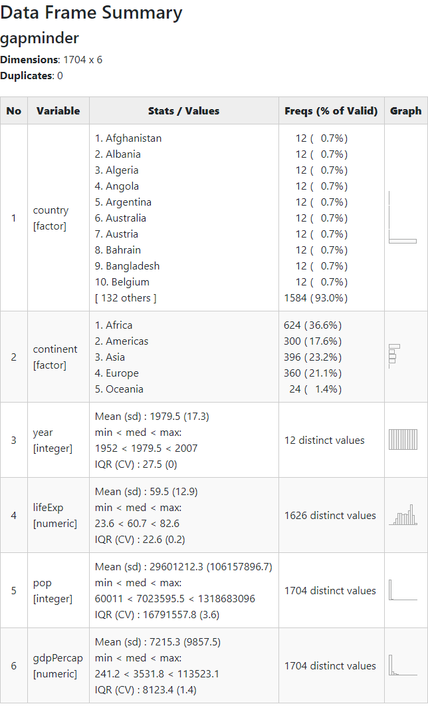

```{r setup, include=FALSE}
library(learnr)
library(gapminder)
library(car)
library(arm)
library(summarytools)
library(performance)
library(nnet)
library(tibble)
library(tidyverse)
library(moments)
```

# 数据分析

## 导语

大家好，我是萌萌！欢迎来到“Learning R with Dr. Hu and His Friends”!

欢迎进入通往`R expert`之旅的数据分析环节。
在本节中，胡老师和我将带领大家进入R语言应用的核心环节，数据分析。
作为统计学家涉及研发的编程语言，R拥有强大的数据分析功能。
本节将对社会科学常见的统计分析方式结合案例进行讲解。

让我们开始吧！

## 知识点

### 概念

+ 平均值和中位数：数据分布的一般性特征

+ 四分位距（Interquantile range, IQR）：用以确定第三四分位数和第一四分位数的区别。

+ 方差：当数据分布比较分散（即数据在平均数附近波动较大）时，各个数据与平均数的差的平方和较大，方差就较大；当数据分布比较集中时，各个数据与平均数的差的平方和较小。因此方差越大，数据的波动越大；方差越小，数据的波动就越小。

+ 偏度（skewness），是统计数据分布偏斜方向和程度的度量。偏度定义中包括右偏分布（也叫正偏分布，其偏度>0），正态分布（偏度=0），左偏分布（也叫负偏分布，其偏度<0）

+ 峰度（kurtosis）：表征概率密度分布曲线在平均值处峰值高低的特征数。直观看来，峰度反映了峰部的尖度，计算方法为随机变量的四阶中心矩与方差平方的比值。

### 分析面向

1. 描述统计:
    + 统计特征
    + 描述性统计表格
2. 分析统计:
    + 二元分析 (t 检验, 相关性分析, 方差分析)
    + 多变量分析 (OLS, MLE)

### 教学数据

我们采用瑞典学者Hans Rosling在[TED 演讲](https://www.ted.com/talks/hans_rosling_shows_the_best_stats_you_ve_ever_seen?utm_campaign=tedspread--b&utm_medium=referral&utm_source=tedcomshare)中使用的人口数据作为案例来进行下面的讲述。
让我们首先来看看数据

```{r toy}
library(gapminder)
gapminder
```


## 描述性统计

### 变量特征描述

计算预期寿命的统计分布特征

```{r moments, exercise = TRUE, exercise.eval = TRUE}
library(tidyverse)
library(moments)
gapminder %>%
  summarise(mean_life = mean(lifeExp),
            median_life = median(lifeExp),
            iqr_life = IQR(lifeExp),  #  IQR = quantile(x, 3/4) - quantile(x, 1/4)
            skew_life = skewness(lifeExp),
            kurtosis_life = kurtosis(lifeExp))
```


```{r moments-solution}
library(broom) #broom是tidyverse系列包之一，可以使建模结果变量更加整洁。
summary(gapminder$lifeExp) %>% tidy
```

### 数据总结

```{r descriptive, exercise = TRUE}
library(summarytools)
freq(gapminder)
```

### 描述性统计表格

```{r descriptivePretty, eval=FALSE}
print(dfSummary(gapminder,
                graph.magnif = 0.3,
                trim.strings = TRUE,
                plain.ascii = FALSE,
                valid.col = FALSE,
                na.col = FALSE),
      method = 'render')
```


```{r excel, out.width = "100%", echo = FALSE}

```

> 萌萌：描述性统计描述的是单一变量，向读者说明某个变量是怎么一个“变”法~

## 分析性统计

### 二元分析

解决问题：两个变量间关系

1. 它们在平均值上有差异吗？
1. 当一个变化时，另一个是不是也会随着变化？
1. 是组内差异大还是组间差异大？

### 

列联表

```{r crossTable}
library(summarytools)
gapminder$coldWar <- gapminder$year <= 1991
gapminder$asia <- gapminder$continent == "Asia"
ctable(gapminder$asia, gapminder$coldWar)
```

### 

平均值比较

冷战前后的人均寿命是否变化吗？

$H_{0}: \bar{LifeExpctancy}_{prio 1991} = \bar{LifeExpctancy}_{post 1991},\ \alpha = .05$

```{r ttest, exercise = TRUE}
gapminder$coldWar <- gapminder$year <= 1992
gapminder %>%
  group_by(coldWar) %>% #根据coldWar分组
  summarise(mean(lifeExp)) 
```

```{r ttest-solution}
t.test(gapminder$lifeExp[gapminder$year <= 1991], gapminder$lifeExp[gapminder$year > 1991])
t.test(gapminder$lifeExp[gapminder$year <= 1991], gapminder$lifeExp[gapminder$year > 1991], alternative = "greater", conf.level = .99) #t 检验
```

### 

相关性

当国民生产总值越多的国家是不是人的预期寿命也就越长？

$H_{0}: \rho_{(LifeExpectancy, GDP)} = 0,\ \alpha = .05$

```{r corr, exercise = TRUE}
cor.test(gapminder$lifeExp, gapminder$gdpPercap) #相关性检验
```

### 

相关性批量计算：如何知道年代、预期寿命、人均GDP和人口间的两两相关性。

```{r corrplot}
select(gapminder, year, lifeExp, gdpPercap, pop) %>% 
  cor %>% # 相关性分析
  corrplot::corrplot.mixed() # 相关性图
```


### 多元分析

### ANOVA

不同年份间预期寿命均值有差异吗？如果考虑到大洲之间的差异呢？

$H_{0}: \mu_{Africa} = \mu_{Americas} = ... = \mu_{Oceania},\ \alpha = .05$

```{r anova, exercise = TRUE}
aov(lifeExp ~ year, data = gapminder) %>%
  summary() #方差分析
```

```{r anova-solution}
aov(lifeExp ~ as.factor(continent) + year, data = gapminder) %>%
  summary()
```


### 最小二乘法(OLS)

也就是很多人嘴里的“线性回归”

一个国家的人均寿命如何在不同大洲和年份之间变动?

```{r ols, exercise = TRUE}
gapminder %>% count(lifeExp, continent, year)
```

```{r ols-solution}
lm(lifeExp ~ as.factor(continent) + year, data = gapminder) %>%  
  summary() 
```


### 变量变换

+ 幂变换

$t + t^2 + t^3$

```{r time, exercise = TRUE}
lm(lifeExp ~ gdpPercap + year, data = gapminder) %>%
  summary()
```


```{r time-solution}
lm(lifeExp ~ gdpPercap + year + I(year^2) + I(year^3), data = gapminder) %>%
  summary()
```

+ 其他变换

`sqrt(var)`, `log(var)`

+ 标准化

```{r standardized}
library(arm)
lm(lifeExp ~ gdpPercap + year + I(year^2), data = gapminder) %>%
  standardize() %>%
  summary()
```


### 交互效应

一个国家的人均国民生产总值对人均寿命的影响是否随着人口数量的变化而变化?

```{r interact, exercise = TRUE}
lm(lifeExp ~ gdpPercap + year, data = gapminder) %>%
  summary()
```

```{r interact-solution}
lm(lifeExp ~ gdpPercap * pop + year, data = gapminder) %>% 
  summary()
```

> 萌萌：需要特别尤其十分地注意，交互效应不可以简单地通过交互项地显著性来解释。正确的解释方法我们会在数据可视化一节讲到，或者或者可以参见胡老师和Fred Solt教授合写的`interplot`[手册](https://cran.r-project.org/web/packages/interplot/vignettes/interplot-vignette.html)。

### 广义线性回归

当结果变量不再是连续变量时，我们需要引入广义线性回归

+ 罗杰斯特回归

```{r logit, exercise = TRUE}
glimpse(mtcars) #查看数据概要
glm(vs ~ gear + wt + mpg, data = mtcars, family = "binomial") %>% #tips：vs是定类（0/1）变量
  summary()
```

### 

对于广义线性的阐释，也需要借助predicted probability 或者marginal effect。

```{r margin, exercise = TRUE}
glm(vs ~ gear + wt + mpg, data = mtcars, family = "binomial") %>%
  ggeffects::ggpredict()
```


### 

+ 定序回归

```{r ologit, exercise = TRUE}
polr(as.factor(gear) ~ wt + mpg, data = mtcars) %>% # tips:gear为定序变量
  summary()
```

```{r ologit-solution}
library(ordinal)
clm(as.factor(gear) ~ wt + mpg, data = mtcars) %>%
  summary()
```

### 

+ 多项分布回归

```{r mlogit, exercise = TRUE}
library(nnet)
multinom(as.factor(cyl) ~ wt + mpg, data = mtcars) %>%
  summary()
```

### 

+ 泊松回归

```{r poisson, exercise = TRUE}
df_poisson <- data.frame(counts = c(18, 17, 15, 20, 10, 20, 25, 13, 12),
                         outcome = gl(3, 1, 9),
# Generate factors by specifying the pattern of their levels.
                         treatment = gl(3, 3))
glm(counts ~ outcome + treatment,
               family = poisson(),
               data = df_poisson) %>%
  summary()
```


## 结果诊断

由于多元回归的统计假定很多，因此需要我们进行一系列的诊断来保证结果是对数据的合理推断。
此类诊断将针对以下目标：

+ 残差
+ 异常值
+ 异方差性
+ 多重共线性
+ 自相关性

......


### 残差

```{r residual, exercise = TRUE}
fit <- lm(lifeExp ~ gdpPercap + year, data = gapminder)
res <- resid(fit) # 残差分析
```

```{r residual-solution}
plot(fit, which  = 1) # plot函数用于画出残差分析图
```

### 异常值

```{r outlier, exercise = TRUE}
library(car)
outlierTest(fit)
# car::qqPlot(fit)
```

### 异方差性

```{r heter, exercise = TRUE}
ncvTest(fit)
```

### 多重共线性

```{r multi, exercise = TRUE}
vif(fit)
```

### 自相关性

```{r durbin, exercise = TRUE}
durbinWatsonTest(fit)
```


### 快速诊断方式

```{r performance, exercise = TRUE}
library(performance)
model_performance(fit)
check_normality(fit)
check_outliers(fit)
```


## 总结

1. 描述:
    + `ctable`
    + `cor`
    + `aov`
2. 分析: `lm/glm/clm/multinom(Y ~ Xs, data)`

###

### 感谢聆听，下次再见！

<i class="fa fa-envelope fa-lg"></i>&nbsp; [yuehu@tsinghua.edu.cn](mailto:yuehu@tsinghua.edu.cn)

<i class="fa fa-globe fa-lg"></i>&nbsp; https://sammo3182.github.io/

<i class="fab fa-github fa-lg"></i>&nbsp; [sammo3182](https://github.com/sammo3182)
