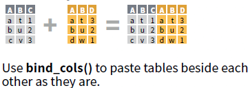

```{r setup, include=FALSE}
library(learnr)
library(tidyverse)
library(gapminder)
```

# Lecture II: Data Munging

## Tasks

1. Vector, matrix, & data frame
1. Filter, select, & summary


## Toy Data

Demographic statistics popularized by [Hans Rosling's TED talks](https://www.ted.com/talks/hans_rosling_shows_the_best_stats_you_ve_ever_seen?utm_campaign=tedspread--b&utm_medium=referral&utm_source=tedcomshare).

```{r toy, exercise = TRUE}
library(gapminder)
gapminder
```

## A Little Review

## What You Can Do

1. Glimpse the data
1. Create, copy, or delete a variable
1. Replace values 

## General Rules

1. Variable -> vector;
2. Conditional replacement;
3. Use functions.

```{r tradition, exercise = TRUE}
## Glimpse the data
head(gapminder, n = 5)
str(gapminder)
```

```{r tradition-solution}
# $, class, table, unique
gapminder$year2 <- gapminder$year
gapminder$year2[gapminder$year2 == 1952] <- 2052
gapminder$year2 <- NULL

names(gapminder)
nrow(gapminder)
ncol(gapminder)
str(gapminder)
mean(gapminder$year, na.rm = TRUE)
median(gapminder$year)
min(gapminder$year)
max(gapminder$year)
length(gapminder$year)
unique(gapminder$year)
table(gapminder$year)
class(gapminder$gdpPercap)
typeof(gapminder$gdpPercap)
class(gapminder$continent)
levels(gapminder$continent)
summary(gapminder$year)
descr::freq(gapminder$year)
```

## Tidyverse

```{r out.width = "100%", echo = FALSE}
knitr::include_graphics("images/tidyverseHive.png")
```


* Prevalent toolkid for data manipulation 
    + Hadley Wickman and the Rstudio team. 
    + [A series of packages](https://www.tidyverse.org/packages/) 

```{r loadTidy, exercise = TRUE}
## install.packages("tidyverse")
library("tidyverse")
```


## A Glimpse of `dplyr` functions

They do one thing, and they do it well.

```{r out.width = "95%", echo = FALSE}
knitr::include_graphics("images/simple.png")
```

## Composability

```{r out.width = "95%", echo = FALSE}
knitr::include_graphics("images/composable.png")
```

Making codes more readable.

Shortcut for `%>%`: 

* Ctrl + Shift + M (Win)
* Cmd + Shift + M (Mac)

## Data Overview

### What Does It Look Like?

```{r out.width = "95%", echo = FALSE}

```

```{r overview, exercise = TRUE}
str(gapminder)
glimpse(gapminder)
```

### View in Order

Q: Which countries have the largest populations?

```{r out.width = "95%", echo = FALSE}
knitr::include_graphics("images/arrange.png")
```

```{r out.width = "95%", echo = FALSE}
knitr::include_graphics("images/desc.png")
```

```{r ex_arrange, exercise = TRUE, exercise.eval = TRUE}
gapminder
```

```{r ex_arrange-solution}
gapminder %>% 
  arrange(pop)
```

### How About Descending

```{r ex_descend, exercise = TRUE, exercise.eval = TRUE}
gapminder
```

```{r ex_descend-solution}
arrange(gapminder, desc(pop))
```

## Filtering Observations

Q: Which countries had the largest population in *2007*?

```{r out.width = "95%", echo = FALSE}
knitr::include_graphics("images/filter.png")
```

```{r ex_filter, exercise = TRUE, exercise.eval = TRUE}
gapminder
```

```{r ex_filter-solution}
gapminder2007 <- filter(gapminder, year == 2007)
arrange(gapminder2007, desc(pop))

gapminder %>% 
  filter(year == 2007) %>% 
  arrange(desc(pop))
```

## Selecting Variables

Q: Subset data:

1. Only country, year, and population
2. Everything but not continent
3. Variables starting with "co"

```{r out.width = "95%", echo = FALSE}
knitr::include_graphics("images/select.png")
```

```{r ex_select, exercise = TRUE, exercise.eval = TRUE}
gapminder
```

```{r ex_select-solution}
gapminder %>% 
  select(country, year, pop)

gapminder %>% 
  select(-continent)

gapminder %>% 
  select(starts_with("co"))
```

## Combo Attack

```{r out.width = "95%", echo = FALSE}
knitr::include_graphics("images/comboAttack.gif")
```

Q: What's the life expectancy of the country that had the largest population in 2007?

```{r ex_combo, exercise = TRUE, exercise.eval = TRUE}
gapminder
```

```{r ex_combo-solution}
gapminder %>% 
  filter(year == 2007) %>% 
  arrange(desc(pop)) %>% 
  select(country, pop, lifeExp)
```

## Modification

Q: What's the total GDP of each country?

```{r out.width = "95%", echo = FALSE}
knitr::include_graphics("images/mutate.png")
```

```{r ex_mutate, exercise = TRUE, exercise.eval = TRUE}
gapminder
```

```{r ex_mutate-solution}
gapminder %>% 
  mutate(gdp = pop * gdpPercap) %>% 
    select(country, pop, gdpPercap, gdp)
```

### Batch Modification

```{r ex_batch, exercise = TRUE, exercise.eval = TRUE}
gapminder
```

```{r ex_batch-solution}
gapminder %>% 
  mutate_if(is.double, round, digits = 0)
```

## Counting

```{r ex_count, exercise = TRUE}
gapminder
```

```{r ex_count-solution}
gapminder %>% 
  count(continent, year)
```

Q4U: Are `count(continent, year)` and `count(year, continent)` the same?

## Summarizing

Q: What was the average GDP per capita?

```{r out.width = "95%", echo = FALSE}
knitr::include_graphics("images/summarise.png")
```

```{r ex_summary, exercise = TRUE}
gapminder
```

```{r ex_summary-solution}
gapminder %>% 
  summarise(mean_gdp = mean(gdpPercap))
```

Q4U: What does the following codes give you?

```{r eval = FALSE}
gapminder %>% 
  mutate(mean_gdp = mean(gdpPercap))
```

## Munging in Group

Q: What was the average GDP per capita for each continent?

```{r out.width = "95%", echo = FALSE}
knitr::include_graphics("images/group_by.png")
```

```{r ex12, exercise = TRUE, exercise.eval = TRUE}
gapminder %>% 
  summarise(mean_gdp = mean(gdpPercap))
```

```{r ex12-solution}
gapminder %>% 
  group_by(continent) %>% 
  summarise(mean_gdp = mean(gdpPercap))
```

### Important note

When doing `gapminder %>% ...`, you are <span style="color:red">NOT</span> adding or changing anything of the `gapminder`.
If you want to save the changes, send the result to an object.

```{r eval = FALSE}
gapminderNew <- gapminder %>% ...
```

## Combining Data

### Appending

```{r out.width = "95%", echo = FALSE}
knitr::include_graphics("images/rowbind.png")
```

Q: Assuming we have two separate data for Asia and Europe (how?), how could we combine them into one? 

```{r ex_append, exercise = TRUE, exercise.eval = TRUE}
gapminder
```

```{r ex_append-solution}
gapminder_asia <- filter(gapminder, continent == "Asia")
gapminder_europe <- filter(gapminder, continent == "Europe")

gapminder_eurasia <- bind_rows(gapminder_asia, gapminder_europe)
```

### Rough Merging

Q: I have several rows and just want to merge them together

```{r out.width = "95%", echo = FALSE}

```

```{r ex_columnBind, exercise = TRUE}
gapminder_country <- select(gapminder, country)
gapminder_year <- select(gapminder, year)
```

```{r ex_columnBind-solution}
bind_cols(gapminder_country, gapminder_year)
```

### Conditional Merging

Q: How can I use two datasets jointly?

```{r out.width = "95%", echo = FALSE}
knitr::include_graphics("images/join.png")
```

```{r ex_join, exercise = TRUE}
gapminder_country <- select(gapminder, country, pop)
gapminder_year <- select(gapminder, year, pop)
```

```{r ex_join-solution}
gapminder_countryYear<- left_join(gapminder_country, gapminder_year)
```

## Take-Home Points

1. Be clear about the logic <span style="color:red">before</span>  the moves;
1. Use the `dplyr` functions wisely and in combo;
1. You will encounter issues you don't know how to solve;
    + Please do some research before asking the experts!
1. Explore more `dplyr` functions.

## Thank you!

<i class="fa fa-envelope fa-lg"></i>&nbsp; [yuehu@tsinghua.edu.cn](mailto:yuehu@tsinghua.edu.cn)

<i class="fa fa-globe fa-lg"></i>&nbsp; https://sammo3182.github.io/

<i class="fab fa-github fa-lg"></i>&nbsp; [sammo3182](https://github.com/sammo3182)
