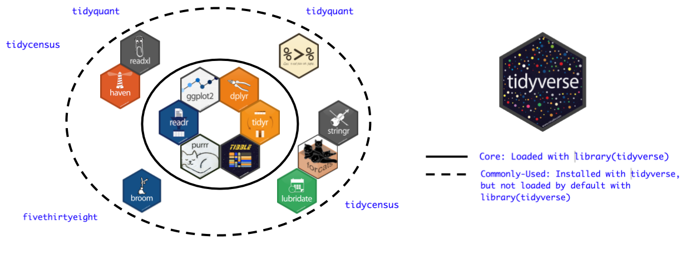
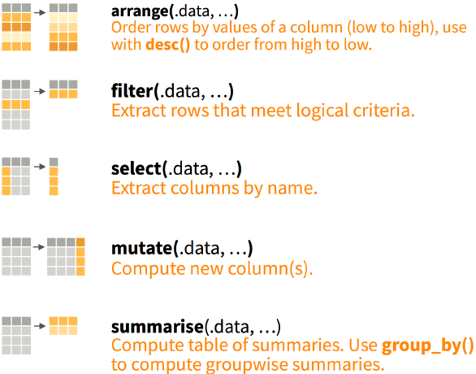
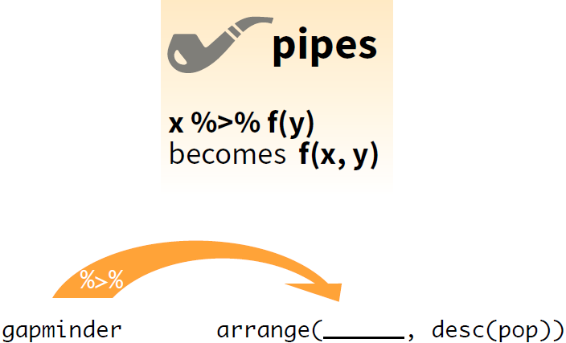

```{r setup, include=FALSE}
library(learnr)
library(tidyverse)
```

# 数据整理

## 导言

大家好，我是萌萌！欢迎来到“Learning R with Dr. Hu and His Friends”!
现在我们将开启成为`R expert`旅程的第二站，数据整理。
在本节中胡老师将带领大家了解最高效的数据清理和调整技术，请认真学习哟！

## 知识点

数据整理：

+ 探索
+ 归纳
+ 提取
+ 调整


### 教学数据

我们采用密歇根大学政治学教授Inglehart在[World Values Survey](https://www.worldvaluessurvey.org/wvs.jsp)中使用的数据作为案例来进行下面的讲述。
让我们首先来看看数据


## 数据探索

数据探索旨在对陌生数据的数据构成、结构、形式、内容的初步了解，是数据分析的第一步，也是关键一步。
我们将数据探索分成三部，用三个动词来表示：瞧，提，钻。

### 瞧：了解数据样貌


```{r glimpse, exercise = TRUE, exercise.eval = TRUE}
head(WVS7, n = 6) # 查看数据框中的前6行

tail(WVS7, n = 3) # 后三行
```

### 提：总结数据结构

* 观察数据大小（多少行，多少列）
* 变量的名字及数量
* 数据结构总览

```{r systemView, exercise = TRUE}
WVS7
```

```{r systemView-solution}
nrow(WVS7) # 获取数据的行数
ncol(WVS7) # 获取数据的列数
names(WVS7) # 获取变量名/列名
str(WVS7) # 获取变量名、变量名类型、行数、列数

#改变数据类型
WVS7$edu <- as.factor(WVS7$edu)
WVS7$sex <- as.factor(WVS7$sex)
WVS7$socialLevel <- as.factor(WVS7$socialLevel)
WVS7$incomeLevel <- as.numeric(WVS7$incomeLevel)
```


### 钻：了解变量

比如人口变量, 我们可能想知道国家人口的一般水平是多少，哪个国家的人口最多／最少, 还有其他内容。 
他们都被存成了什么类？

```{r variable, exercise = TRUE}
head(WVS7$year, n = 10) #查看年份前10行
```

```{r variable-solution}
mean(WVS7$year, na.rm = TRUE) #求取年份的平均值，na.rm = TRUE表示忽略NA
median(WVS7$year) #求取年份的中间值
min(WVS7$year) #求取年份的最小值
max(WVS7$year) #求取年份的最大值
length(WVS7$year) #求取年份的长度（此处为行数）
summary(WVS7$year) #获取年份的上述所有信息
class(WVS7$year) #查看年份结构：vector、matrix、array、dataframe、list
typeof(WVS7$year) #查看年份元素类型
```

## 数据归纳

数据归纳是对数据特征的挖掘和整理。
我们将使用`tidyverse`系列函数来实现高效数据归纳。

### 什么是`tidyverse`

+ 是一个R包
+ 其实是一群[R包](https://www.tidyverse.org/packages/)！
+ 像漫威和DC漫画宇宙一样，所有`tidyverse`组成成员都在同一个数据结构内工作，可以相互对话，共同使用。

### `tidyverse`组成

```{r out.width = "100%", echo = FALSE}

```

###

+ 安装:

```{r loadTidy, exercise = TRUE}
## install.packages("tidyverse")
library("tidyverse")
```
。

### `dplyr`包

`tidyverse`中专门负责数据清理的组件，贯彻一个函数做一件事的风格。

+ 专门性

```{r out.width = "80%", echo = FALSE}

```


+ 组合性

```{r out.width = "80%", echo = FALSE}

```

`%>%`的快捷键:

* Ctrl + Shift + M (Win)
* Cmd + Shift + M (Mac)

### `arrange`

```{r out.width = "60%", echo = FALSE}
knitr::include_graphics("images/arrange.png")
```

```{r out.width = "90%", echo = FALSE}
knitr::include_graphics("images/desc.png")
```

###

将数据根据采访年份排列？

```{r ex_arrange-solution, exercise = TRUE}
WVS7 %>%
  arrange(year) # arrange函数用于排序，此处为按照采访时间从小到大进行排序

arrange(WVS7, desc(year)) #此处为按照采访年进行降序排列
```

### `count`

数据中对于每个国家各有多少个观测值？

```{r ex_count, exercise = TRUE}
WVS7 %>%
  count(country)

# WVS7 %>%
#   add_count(country) # adding the count number to the dataset.
```

### `summary`

```{r out.width = "95%", echo = FALSE}
knitr::include_graphics("images/summarise.png")
```

###

年龄和受教育年限的中位数分别是什么?

```{r ex_summary, exercise = TRUE}
WVS7 %>%
  summarise(mean_age = mean(age), median_edu = median(edu))
```

### `group_by`

```{r out.width = "95%", echo = FALSE}
knitr::include_graphics("images/group_by.png")
```

###

*每个国家的*年龄和受教育年限的中位数分别是多少？

```{r ex_summaryG, exercise = TRUE}
WVS7 %>%
  group_by(country) %>%
  summarise(mean_age = mean(age), median_edu = median(edu))
```

## 数据提取

`dplyr`中也能帮助我们实现数据提取，主要通过`filter`和`select`实现。

### `filter`

```{r out.width = "95%", echo = FALSE}
knitr::include_graphics("images/filter.png")
```

###

如何知道*2018*年哪个国家的人口数量最多？

```{r ex_filter, exercise = TRUE, exercise.eval = TRUE}
WVS7 %>%
  arrange(desc(id))
```

```{r ex_filter-solution}
WVS7 %>%
  filter(year == 2007) %>% #filter函数筛选出年份为2007年
  arrange(desc(id)) #再根据采访id进行降序排列
```

### `select`

```{r out.width = "95%", echo = FALSE}
knitr::include_graphics("images/select.png")
```

1. 提取国家，年份和人口
2. 除了大洲的一切
3. 以"co"开头的变量

###

```{r ex_select, exercise = TRUE}
WVS7 %>%
  dplyr::select(country, year, pop) #选择国家、年份、人口规模
```

```{r ex_select-solution}
WVS7 %>%
  select(-country) #去掉国家

WVS7 %>%
  select(starts_with("co")) #匹配以“co”开头的名称
```


### 挑战时间？

想要从跨年数据中提取2018年的国家及其年龄和受教育程度，应该怎么做？


```{r out.width = "80%", echo = FALSE}

```

###

```{r ex_combo-solution}
WVS7 %>%
  filter(year == 2018) %>%
  arrange(desc(age)) %>%
  dplyr::select(country, age, edu)
```

## 数据调整

在数据分析中，我们常常要将数据进行调整和再加工，`mutate`可以帮你做到这一点。
英文中“mutate”表示“变异”，也就是说这个函数可以实现的并不是无中生有，而是改头换面。

### `mutate`

```{r out.width = "95%", echo = FALSE}
knitr::include_graphics("images/mutate.png")
```

###

知道了年龄和受教育程度，如何知道受教育水平/比例?

```{r ex_mutate, exercise = TRUE}
WVS7 %>%
  mutate(age_edu = edu/age) %>% #可根据已有变量添加新的变量，将新添加的列到已有列的末尾
    dplyr::select(country, age,edu)
```

### 条件性改变

如何对变量进行批量修改？`dplyr`和它的朋友`tidyselect`提供了`across`和`where`函数。
让我们看看如何通过这些函数实现将数据中所有的非整数变量都四舍五入取整？

```{r ex_batch, exercise = TRUE}
WVS7 %>%
  mutate(across(where(is.double), round, digits = 0))
```

### 根本原则

基于`tidyverse`的数据整理，有一个重要的核心前提：“不改变原始数据”——这也是所有数据分析者都应遵守的原则。
你会发现无论你使用以上命令对原数据做了什么, 你实际都<span style="color:red">没有</span>增加或改变`WVS7`的任何东西。

如果你想把变化保存下来, 你要把结果赋值给一个新的对象，而保持你原来数据的完整性。

```{r eval = FALSE}
WVS7New <- WVS7 %>% ...
```

## 总结

1. 行动<span style="color:red">之前</span> 想清楚;
1. 巧妙且综合地使用 `dplyr` 函数;
    + 探索: `glimpse`
    + 归纳: `arrange`, `count`, `summarise`
    + 提取: `filter`, `select`
    + 调整: `mutate`
1. 条件性操作
    + `group_by`
    + `across` & `where`
    + `starts_with`, etc.

## Bonus

```{r df_coalesce, exercise = TRUE}
df_toy <- data.frame(x = sample(c(1:2, NA, NA, NA)),
                     y = c(1, 2, NA, NA, 5),
                     z = c(NA, NA, 3, 4, 5))

df_toy
```

###

怎么样才能填补缺失的 `x`, 然后把 `y` 和 `z` 合并成一个变量呢?

```{r coalesce, exercise = TRUE}
df_toy %>%
  mutate(x = coalesce(x, 0L),
         yz = coalesce(y, z))
```


### 感谢聆听，下次再见！

<i class="fa fa-envelope fa-lg"></i>&nbsp; [yuehu@tsinghua.edu.cn](mailto:yuehu@tsinghua.edu.cn)

<i class="fa fa-globe fa-lg"></i>&nbsp; https://sammo3182.github.io/

<i class="fab fa-github fa-lg"></i>&nbsp; [sammo3182](https://github.com/sammo3182)
