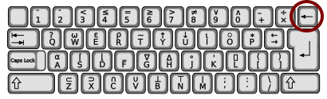
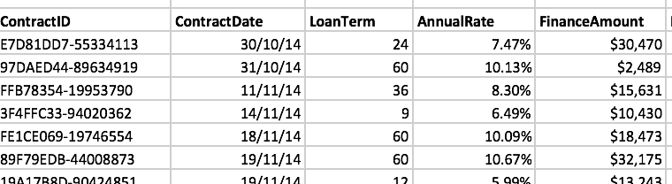
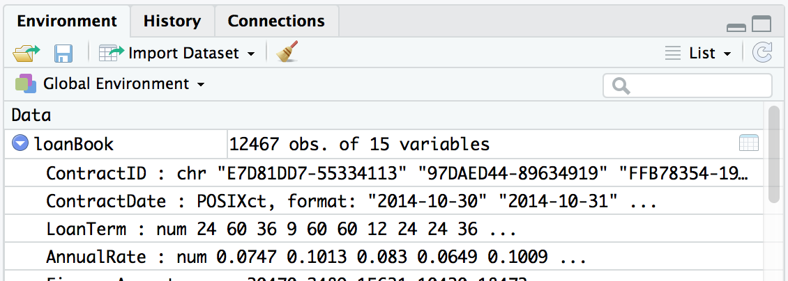

```{r setup, include=FALSE}
chooseCRANmirror(graphics = FALSE, ind = 1)
knitr::opts_chunk$set(echo = TRUE,
                      message = FALSE,
                      warning = FALSE,
                      out.width = "100%")

if (!require(pacman)) install.packages("pacman")

pacman::p_load(
  lubridate,
  here,
  rio,
  tidyverse,
  drhur
)
```


<!-- https://appsilon.com/oop-in-r-with-r6/ -->
<!-- https://matloff.wordpress.com/2022/07/25/comments-on-the-new-r-oop-system-r7/ -->


## 知识点

- 研究问题：
   **我们要对不平等认知对社会政治行为影响进行研究，那 WVS7 能给我们什么有用的相关信息呢？**
   - 一个人的家庭经济状况会影响其受教育程度吗？
   - 不同国家的公民对于政府信任的水平如何？
   - 不平等认知会对人的社会政治行为产生影响吗？

- 基础概念
- 数据输入
- 数据种类
- 数据属性
- 数据输出


## 面向对象编程

上一章介绍了 R 是如何实现数学和统计教材中的内容。本章将换一个角度，从编程的层面介绍 R 语言的一些基础概念。在此基础上，我们将进入 R 语言编程的第一步：数据的输入与输出。也就是说，要完成数据分析的"一头一尾"：如何将数据导入，以及如何把清理后的数据或分析结果导出。此外，我们还将学习如何利用 R 命令了解数据的基本特征，例如数据规模、变量数量和观测数等。

首先，让我们对 R 的编程特征建立一个初步的认识：

###

**面向对象编程**（Object-Oriented Programming，OOP）是一种常见的计算机编程架构。与传统的过程化编程（Procedure-oriented Programming）相比，这种架构能通过数据组织和封装，处理更复杂的系统和多种需求。现代很多鼎鼎大名的编程语言，比如 C++、Java、Ruby、Python，都采用了 OOP 架构。R 也是如此。理解 OOP，将方便我们理解 R 的很多操作逻辑。（但 R 其实是一种非常特别的 OOP 语言——这一点等我们讲到函数概念时候再细表。）

OOP 语言有两个基本概念：类（**class**）和对象（**object**）。

- **类（Classes）**：使用者可自定义的*对象*结构及其特征和*方法*。
- **对象（Objects）**：特定类别的具体实例，如"中国"之于"国家"，"R"之于"字母"。这些实例均具备其所属类的*属性*。
- **方法（Methods）**：在类内定义的一些命令，这些命令可以用来表现该类对象的一些特征行为，比如人会吃喝拉撒睡，那么这"吃喝拉撒睡"就是人的"方法"。
- **属性（Properties）**：用于描述某对象的一些方面，比如发色、肤色、身高、体重之于一个人。这些属性是同一类中所有对象都具备的，但具体取值可能各有不同。可以将属性想象成这个对象的"参数"。

###

除此之外，OOP 语言通常还共享以下四个特性：

- **封装（Encapsulation）**：把一个对象的所有属性和方法都打包在一起。这些东西其他对象都不能从外看到或进行改变，只能加以影响。比如，您不能把一个变温动物变成一个恒温动物，但您可以通过调节室外气温来影响一个变温动物的体温。
- **多态（Polymorphism）**：一个命令可以对不同对象进行不同的处理。最典型的例子是 `summary()`。

```{r polymorphism, exercise = TRUE}
summary(wvs7)
summary(wvs7$age)
```


### 现学现练

R 的多态（Polymorphism）让我们能够用通用方法或函数来处理那些尚未定义的对象类型，除 `summary()` 外，`plot()` 是另外一个多态的例子。请使用 `plot()` 对两种不同的对象进行处理，看看结果如何。

```{r polymorphism_exercise, exercise = TRUE}
plot(wvs7$age)
plot(wvs7$age, wvs7$incomeLevel)
```

###

- **继承（Inheritance）**：所谓继承就是指对于同一个父类的所有子类都自动具备了父类的特征。做个类比，如果人有双腿，那么每个人类个体都将有这个性质。
- **安全（Safety）**：命令作用于对象时，会对对象的类进行判断，如果不是命令定义范围内能处理的对象，则会停止运行，给出错误提示。


### 函数：状语后置的祈使句

R 是由两类基本元素构成的：函数和对象。**函数**可以被视为一种"状语后置"的祈使句——和典型的英语语序正好相反。一般形式是：

> `<函数名>(<目标数据>, <条件 1>, <条件 2>, ...)`

OOP 之信仰：*不触碰*数据，让命令去做。


{height=500}

```{r funIllustration, eval = FALSE}
light <- function(finger){
  shadow <- finger + 5
  shadow
}
handShadow <- light(finger = 3)
handShadow
```


### 软件包：函数的集合

**软件包（package）**是函数的集合——就像手机里的一个个 App。CRAN 中目前有数万个注册软件包（GitHub 上还有更多）。两种常用的安装方式：

```{r install, eval = FALSE}
install.packages("drhur")                          # 从 CRAN 安装
devtools::install_github("sammo3182/drhur")         # 从 GitHub 安装
```


### 赋值符 `<-`

`<-` 是 R 中最常用的赋值符，是 `assign()` 命令默认行为的简写。一般形式是：

> `<名称> <- <对象>`

```{r object}
aValidObject <- 1:5
aValidObject
```


### `->`、`=`、`<<-`

R 中赋值的四种符号：

1. `assign()`
2. `<-`
3. `<<-`
4. `=`


### 为什么用 `<-`



- 指向直观

```{r arrow}
a <- 12
25 -> b
```

- 不和"等于"混淆
- 快捷键输入
    - PC：`Alt + -`
    - Mac：`option + -`


### 何时用

- `=`：不想创建对象时使用，比如函数调用中传入命名参数。

```{r sideEffect, exercise = TRUE}
median(y <- 1:10); y
median(x = 1:10); x
```

- `<<-`：援引父级变量，常出现在闭包中。

```{r superassign}
new_counter <- function() {
  i <- 0
  function() {
    # do something useful, then ...
    i <<- i + 1
    i
  }
}
```


### 命名规则

R 中对象命名需满足以下约束：

1. 不以数字开头（错误：`1stday`）。
2. 除了 `.` 和 `_` 以外没有其他特殊符号（错误：`M&M`）。
3. 区分大小写（`X != x`），`!`表示"非"/"否"，`!=`表示"不等于"。
4. 如非必要请勿重写内置命令（避免：`list <- c(1:5)`）。
5. 表意命名。

请创建一个合规和不合规的对象：

```{r objectEg, exercise = TRUE}

# 创建一个不合规的对象

# 5var_name <- data_frame($education)


# 一个合规对象

var_name5 <- data_frame(wvs7$education)

```


### 现学现练

```{r vname, echo = FALSE}
question("请选择所有合规的变量名？",
  answer("my_data_frame <- data_frame(wvs7$education)", correct = TRUE),
  answer("mydata&frame <- data_frame(wvs7$education)"),
  answer("MyDataFrame <- data_frame(wvs7$education)", correct = TRUE),
  answer("1data_frame <- data_frame(wvs7$education)"),
  incorrect = "再想想——名称不能以数字开头，且只能包含字母、数字、`.` 和 `_`。")
```


## 数据输入

### 内置数据

```{r mtcars, exercise = TRUE}
data()
```


### 现学现练

在 `data()` 里选择一个数据打开并通过 `summary()` 检查其中的变量：

```{r mtcars_exercise, exercise = TRUE}


```

```{r mtcars_exercise-solution}
# 举例
data(uspop)
summary(uspop)
```


### 可直读数据

- `.RDS`（单一对象）
- `.RData`（多个对象）
- `.txt`
- `.csv`

> 语法： `<名称> <- <读取命令>(<数据路径>)`

```{r input, eval = FALSE}
df_rds <- readRDS("aDataset.rds")
df_txt <- read.table("D:/aDataset.txt")
df_csv <- read.csv("./aDataset.csv")
```


### 调用包读取数据

通过 `library` 或者 `require` 调用数据包，然后使用其中的命令。

```{r read_pkgs, eval = FALSE}
# SPSS, Stata, SAS
library(haven)
df_spss  <- read_spss("<FileName>.sav")
df_stata <- read_dta("<FileName>.dta")
df_sas   <- read_sas("<FileName>.sas7bdat")

# 表格的快速导入
library(readr)
df_csv   <- read_csv("<FileName>.csv")
df_table <- read_table("<FileName>.txt")

# Excel 表格
library(readxl)
df_excel  <- read_excel("<FileName>.xls")
df_excel2 <- read_excel("<FileName>.xlsx")

# JSON (JavaScript Object Notation)
library(rjson)
df_json <- fromJSON(file = "<FileName>.json")

# XML / HTML
library(xml2)
df_xml  <- read_xml("<url>")
df_html <- rvest::html_table(rvest::read_html("<url>"))
```

###

数据读取界的瑞士军刀：`rio`

```{r rio, eval = FALSE}
library(rio)
df_anything <- import(<AnyTypeOfData>)
```


## 数据种类

1. 向量（vector）
2. 矩阵（matrix）
3. 数据框（data frame）
4. 列（list）
5. 阵列（array）


### 向量

执行组合功能的命令 `c()` 可用来创建向量。一个向量内的元素必须共享同一种数据类型——数值型、字符型、逻辑型、因子型等。

#### 数字向量（numeric vector）

```{r numeric, exercise = TRUE}
vec_integer <- c(1, -2, NA)
vec_double  <- c(1.5, -2.34, 1/3)
```

注意：

1. `NA` 表示的是：not available（缺失值）
2. 单个向量中的数据必须拥有相同的类型（数值型、字符型或逻辑型）


### 现学现练

生成一个包含 1-100 中全部偶数的向量：

```{r numeric_exercise, exercise = TRUE}
# hint: help(seq)

```

```{r numeric_exercise-solution}
seq(2, 100, by = 2)
```


#### 字符向量（character vector）

```{r character, exercise = TRUE}
vec_chr <- c("牛", "^_^", "R is hard，but I can nail it.")
```


### 现学现练

生成一个 a-z 的字母序列：

```{r character_exercise, exercise = TRUE}
vec_letters <- c("a", "b", "c", "d", "e")
```

```{r character_exercise-solution}
letters[1:26]
```


#### 逻辑向量（logic vector）

```{r logic, exercise = TRUE}
vec_tf <- c(TRUE, TRUE, FALSE)
vec_tf
# c(TRUE, TRUE, FALSE) == c(1, 1, 0)
```


### 现学现练

假设 x 为包含 (1, 1, 0) 的向量，将它转化为逻辑向量：

```{r logic_exercise, exercise = TRUE}

```

```{r logic_exercise-solution}
x <- c(1, 1, 0)
x <- as.logical(x)
```


#### 类别向量（factor vector）

- 定序变量（ordinal vector）

```{r factor, exercise = TRUE}
vec_fac <- factor(c(1, 2, 2, 3))
```

```{r factor-hint}
vec_ord <- ordered(c(1, 2, 2, 3))
vec_fac2 <- factor(c(1, 2, 2, 3),
                   levels = c(3, 2, 1),
                   labels = c("Apple", "Pear", "Orange"))
```


### 现学现练

在拿到一个数据集后，先要对数据有个大致的了解。

先查看 wvs7 数据里的变量分别是什么类型：

```{r factor_exercise1, exercise = TRUE}


```

```{r factor_exercise1-solution}
str(wvs7)
```

###

查看数据集里 incomeLevel 这个变量的性质：

```{r factor_exercise2, exercise = TRUE}


```

```{r factor_exercise2-solution}
class(wvs7$incomeLevel)
```

###

查看 incomeLevel 的取值和每个取值的频次情况：

```{r factor_exercise3, exercise = TRUE}


```

```{r factor_exercise3-solution}
table(wvs7$incomeLevel)
```


#### 时间向量（POSIXct / POSIXlt vector）

- `as.POSIXct`（numeric input），整数存储
- `as.POSIXlt`（character input），列存储
- POSIXct 用某个时间到 UNIX 元年（1970-01-01 00:00:00）所经过的秒数来记录时间，即通过计数的方式表示时间（count time）；而 POSIXlt 用列表方式表示时间（list time），时间的每一部分都是列表的一个元素。

```{r time_POSIXct_POSIXlt}
# `as.POSIXct` 与 `as.POSIXlt` 的区别
ct <- as.POSIXct("2023-03-20 10:11:12")
lt <- as.POSIXlt("2023-03-20 10:11:12")
```

```{r time_POSIXctandPOSIXlt}
unlist(ct)
unlist(lt)
```

```{r time, exercise = TRUE}
Sys.time() # 获取当前时间
today()    # 获取当日的 年月日
now()      # 获取当日的 年月日 时分秒 时区
# CST 为操作时电脑 ip 所在的时区

# The full pack
time1 <- Sys.time()
time2 <- as.POSIXlt(Sys.time())
time2$wday # week of the day

## 如果我只在乎日期呢？
```

```{r time-hint}
Sys.Date()
date1 <- as.Date("2019-01-02")
class(date1)  # 查看数据类型
```

###

时间数据的瑞士军刀：`lubridate`

```{r date, exercise = TRUE}
library(lubridate)

ymd("20221016")
mdy("10-16-2022")
dmy("16/10/2022")
ymd_hms("2022-10-16 09:00:00", tz = "Etc/GMT+8")
```

```{r date-hint}
OlsonNames()
```


### 现学现练

当面对顺序不一样的向量时，如：

```
x <- c("20190101", "01012019", "021901")
```

应该怎么识别时间呢？

```{r date_exercise, exercise = TRUE}
# help(parse_date_time)

```

```{r date_exercise-solution}
x <- c("20190101", "01012019", "021901")
parse_date_time(x, orders = c("ymd", "dmy", "dym"))
```


### 矩阵

矩阵（matrix）见上一章 `drhur("calculate")`。


### 阵列

阵列（array）：顾名思义就是列的"阵"，可用于记录二维以上的数据，可通过 `array` 命令创建。

```{r array}
# 创建两个长度不同的向量。
vector1 <- c(5, 9, 3)
vector2 <- c(10, 11, 12, 13, 14, 15)

# 把这些向量输入到数组中。
result <- array(c(vector1, vector2), dim = c(3, 3, 2))
result
```


### 列

列（list）：可包含多种不同类型对象的"串"。

```{r list}
ls_monks <- list(name   = c("Wukong Sun", "Sanzang Tang", "Wuneng Zhu", "Wujing Sha"),
                 power  = c(100, 20, 90, 40),
                 buddha = c(TRUE, TRUE, FALSE, FALSE))

ls_monks
```


### 数据框

数据框（Data Frame）：一种特殊的列/矩阵

- 列：变量，所有列长度都相等
- 行：观测量

在 Excel 中：



在 R 中：

```{r dataframe}
df_toy <- data.frame(female = c(0, 1, 1, 0),
                     age    = c(29, 39, 38, 12),
                     name   = c("Iron Man", "Black Widow", "Captain Marvel", "Captain America"))

df_toy
```

在 RStudio 中：




## 数据属性

1. `class`、`typeof`：查询变量属性
2. `nchar`：获取字符串的长度
3. `levels`：获取或设置因子的级别
4. `nrow`：返回指定矩阵的行数
5. `ncol`：用于返回指定矩阵的列数
6. `dim`：列向量张成的子空间，即维度

```{r attribute, exercise = TRUE}
vec_integer <- c(1, -2, NA)

vec_double <- c(1.5, -2.34, 1/3)

vec_chr <- c("牛", "^_^", "R is hard，but I can nail it.")

vec_fac <- factor(c(1, 2, 2, 3))

ls_monks <- list(name   = c("Wukong Sun", "Sanzang Tang", "Wuneng Zhu", "Wujing Sha"),
                 power  = c(100, 20, 90, 40),
                 buddha = c(TRUE, TRUE, FALSE, FALSE))

df_toy <- data.frame(female = c(0, 1, 1, 0),
                     age    = c(29, 39, 38, 12),
                     name   = c("Iron Man", "Black Widow", "Captain Marvel", "Captain America"))

class(vec_double)
typeof(vec_integer)

nchar(vec_chr)
levels(vec_fac)

length(vec_double)
length(ls_monks)
length(df_toy)

nrow(df_toy)
ncol(df_toy)
dim(df_toy)
```


### 现学现练

将下面的向量转化为 numeric 类型：

```
c(FALSE, TRUE)
```

```{r attribute_exercise1, exercise = TRUE}
# help(as.numeric)

```

```{r attribute_exercise1-solution}
as.numeric(c(FALSE, TRUE))
```

###

wvs7 里的性别变量 `female` 的数值是 `TRUE`、`FALSE`。

在具体分析的时候，字符型变量不便操作，可以把它转换为数值型的 0/1 变量。

```{r attribute_exercise2, exercise = TRUE}

```

```{r attribute_exercise2-solution}
as.numeric(wvs7$female) - 1
```


## 数据输出

> 语法：`<命令>(<待存数据>，file = <存储路径>)`

### 储存为 R 数据

```{r saving, eval = FALSE}
saveRDS(df_toy, file = "df_toy.rds")
save(df_toy, ls_monks, file = "test.rdata")
```


### 储存为 csv 文件

```{r savingCSV, eval = FALSE}
write.csv(df_toy, file = "toy.csv")
```

<div class="alert alert-info">

**编码提示**

如果您的数据包含中文（或其他非拉丁字符），`write.csv()` 在某些系统上可能产生乱码。指定 `fileEncoding = "UTF-8"`，或者使用 `readr::write_csv()` 通常可以解决该问题。

</div>

###

当然了，您可以通过专门软件包或"瑞士军刀"（`rio::export`）把数据以 STATA、SPSS、SAS、Excel、JSON、Matlab、HTML 等格式存储下来，不过您真的想这样吗？

STATA (.dta, < 14): 3.16 G = R (.rds): 0.05 G

| **Method**       | **Average Time** | **Minimum** | **Maximum** |
|:-----------------|:----------------:|:-----------:|:-----------:|
| `base::readRDS`    |       19.65    |    18.64    |    21.01    |
| `fst::read_fst`    |        1.39    |     0.56    |     3.41    |
| `haven::read_sav`  |      104.78    |   101.00    |   111.85    |
| `qs::qread`        |        3.33    |     3.00    |     4.24    |

: 四种在 R 中读取 GSS 数据的方式所用的平均时间（以秒计）

| **Method**      | **Average Time** | **Minimum** | **Maximum** | **File Size** |
|:----------------|:----------------:|:-----------:|:-----------:|:-------------:|
| `base::saveRDS`   |       98.36    |    93.09    |   103.24    |    30.9 MB    |
| `fst::write_fst`  |        2.70    |     1.86    |     4.05    |   122.1 MB    |
| `qs::qsave`       |        5.03    |     4.35    |     6.62    |    44.6 MB    |

: 在 R 中写入 GSS 数据（及文件大小）所用的平均时间


## 总结

- 基础概念
    - OOP（面向对象编程）
    - 函数与软件包
    - 赋值
- 数据输入
    - 内置 / csv
    - 数据包辅助
- 数据种类
    - 向量
    - 矩阵
    - 阵列
    - 列
    - 数据框
- 数据属性
- 数据输出
    - 储存为 R 数据
    - 储存为其他数据类型
