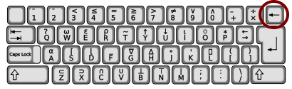

```{r setup, include=FALSE}
chooseCRANmirror(graphics = FALSE, ind = 1)
knitr::opts_chunk$set(echo = TRUE,
                      message = FALSE,
                      warning = FALSE,
                      out.width="100%")

if (!require(pacman)) install.packages("pacman")

p_load(
  lubridate,
  here,
  rio,
  tidyverse,
  drhur
)
```


<!-- https://appsilon.com/oop-in-r-with-r6/ -->
<!-- https://matloff.wordpress.com/2022/07/25/comments-on-the-new-r-oop-system-r7/ -->

## Key Points

- Research Question:
   **We want to study the impact of perceptive inequality on social and political behavior. What useful information can we get from WVS7?**
   - Does a person's family economic status affect their level of education?
   - How do citizens of different countries differ in their level of trust in government?
   - Does perceptive inequality have an impact on a person's social and political behavior?   
  
     
       
       
- Basic Concepts
- Data Input
- Data Types
- Data Attributes
- Data Output  

## Basic Concepts
### Object-Oriented Programming Language

- Object-Oriented Programming (OOP)
    - C++ (first applied)
    - Python (first from the ground up)
    - R

- **Classes**: A user-definable *object* structure with its characteristics and *methods*.
- **Objects**: Concrete examples of specific categories, such as "China" for "country", "R" for "letter". Each of these instances has *properties* of the class it belongs to.
- **Methods**: Some commands defined in the class can be used to express some characteristic behaviors of objects of this class, for example, people will eat, drink and sleep, then this "eating, drinking and sleeping" is the "method" of people.
- **Properties**: Used to describe some aspects of an object, such as hair color, skin color, height, and weight to a person. These attributes are common to all objects in the same class, but the specific values may be different. Properties can be thought of as "parameters" for this object.

###

- **Encapsulation**: Bundling all of an object's properties and methods together so that other objects cannot see or change them from the outside. For example, you cannot turn a cold-blooded animal into a warm-blooded animal, but you can affect the body temperature of a cold-blooded animal by adjusting the outdoor temperature.
- **Polymorphism**: Using a command to perform different actions on different objects. The most typical example is`summary()`.

```{r polymorphism, exercise=TRUE}
summary(wvs7)
summary(wvs7$age)
```

### Learning by Doing

R's Polymorphism allows us to use common methods or functions to deal with object types that have not yet been defined. In addition to `summary()`, `plot()` is another example of Polymorphism. Please use `plot()` to process two different objects.

```{r polymorphism_exercise, exercise=TRUE}
plot(wvs7$age)
plot(wvs7$age, wvs7$incomeLevel)
```

- **Inheritance**: The so-called inheritance means that all subclasses of the same parent class automatically have the characteristics of the parent class. As an analogy, if humans had legs, then every individual human being would have this property.

- **Safty**: When the command acts on the object, it will judge the class of the object. If it is not an object that can be processed within the scope of the command definition, it will stop running and give an error message.

### Function

- R = Function + Object
- Function：*Command*

> The principle of OOP: *don't change data manually* , let the commands do it.
> Syntax: <`command name`>(<`target data`>, <`condition 1`>, <`condition 2`>, ...)


{height=500}

```{r funIllustration, eval = FALSE}
light <- function(finger){
  {{shadow <- finger + 5}}
}
handShadow <- light(finger = 3)
handShadow
```

### Data Packages

- Command Collection
- App
- `r nrow(available.packages())` in CRAN (more in Github)
- `install.packages("drhur")`
- `devtools::install_github("sammo3182/drhur")`

{height=300}

### `<-`

Assignment operator, the shorthand for the `assign()` command

> Syntax: <`variable name`> `<-` <`object`>

```{r object}
aValidObject <- 1:5
aValidObject
```

### `->`, `=`, `<<-`

Four symbols for assignment in R:

1. `assign()`
1. `<-`
1. `<<-`
1. `=`


### Why `<-`



+ Intuitive


```{r arrow}
a <- 12
25 -> b
```

+ Will not be confused with "="
+ Shortcut input
    + PC: `Alt + -`
    + Mac: `option + -`


### What Time to Use the Command?

- `=`: When you do not want to create an object.

```{r sideEffect, exercise = TRUE}
median(y <- 1:10); y
median(x = 1:10); x
```

- `<<-`: Invoke parent variables

```{r}
new_counter <- function() {
  i <- 0
  function() {
    # do something useful, then ...
    i <<- i + 1
    i
  }
}
```


### Naming Rules

1. Don't start with a number (Error: `1stday`).
1. No special symbols except `.` and `_` (Error: `M&M`).
1. Case sensitive (`X != x`) `! means "not"/"no", `!=` means "not equal to".
1. Don't override built-in commands if necessary(avoid: `list <- c(1:5)`).
1. Ideographic Naming.


Please create a compliant and non-compliant object:


```{r objectEg, exercise = TRUE}


# Create a non-compliant object

# 5var_name <- data_frame($education)


# Create a compliant object

var_name5 <- data_frame(wvs7$education)

```

### Learning by Doing

```{r vname, echo=FALSE}
question("Which variables are compliant? Please select all valid variable names.",
  answer("my_data_frame <- data_frame(wvs7$education)", correct = TRUE),
  answer("mydata&frame <- data_frame(wvs7$education)"),
  answer("MyDataFrame <- data_frame(wvs7$education)", correct = TRUE),
  answer("1data_frame <- data_frame(wvs7$education)"),
  incorrect = "Incorrect")
```


## Data Input

### Built-in Data
```{r mtcars, exercise = TRUE}
data()
```

### Learning by Doing

Select a data in `data` to open and check the variables in it by summary:

```{r mtcars_exercise, exercise=TRUE}


```

```{r mtcars_exercise-solution}
# example

data(uspop)
summary(uspop)
```

### Data Types That Can Be Read Directly

- `.RDS` (single object)
- `.RData` (multiple objects)
- `.txt`
- `.csv`

> Syntax: <`name`>`<-` <`read command`>(<`data path`>)


```{r input, eval = FALSE}
df_rds <- readRDS("aDataset.rds")
df_txt <- read.table("D:/aDataset.txt")
df_csv <- read.csv("./aDataset.csv")
```

### Data Types Need To Call The Package To Read

Call the package through `library` or `require`, and then use the commands in it.

```{r eval=FALSE}
# SPSS, Stata, SAS
library(haven)
df_spss <- read_spss("<FileName>.sav")
df_stata <- read_dta("<FileName>.dta")
df_sas <- read_sas("<FileName>.sas7bdat")  

# Quick Import of Forms
library（reader）
df_csv <- read.csv("<FileName>.csv")
df_table <- read.table("<FileName>.csv/txt")

# Excel
library(readxl)
df_excel <- read_excel("<FileName>.xls")
df_excel2 <- read_excel("<FileName>.xlsx")

# JSON (JavaScript Object Notation)
library(rjson)
df_json <- fromJSON(file = "<FileName>.json" )

# XML/Html
library(xml)
df_xml <- xmlTreeParse("<url>")
df_html <- readHTMLTable(url, which=3)
```

###

The Swiss Army Knife of data reading:`rio`

```{r eval = FALSE}
library(rio)
df_anything <- import(<AnyTypeOfData>)
```


## Data Type

1. Vector
2. Matrix
3. Data frame
4. List
5. Array


### Vector

The command `c()` which performs a composition function can be used to create a vector


- numeric vector

```{r numeric, exercise = TRUE}
vec_integer <- c(1, -2, NA)
vec_double <- c(1.5, -2.34, 1/3)
```

Notes: 1. `NA` means: not available  
      2. The data in a single vector must have the same type (numeric, character, or logical)

### Learning by Doing

Generate a vector containing all even numbers from 1 to 100:

```{r numeric_exercise, exercise=TRUE}
# hint: help(seq)

```


```{r numeric_exercise-solution}
x <- seq(2,100,by=2)

```

###

- character vector

```{r character, exercise = TRUE}
vec_chr <- c("牛", "^_^", "R is hard，but I can nail it.")
```

### Learning by Doing

Generate a sequence of letters a-z:

```{r character_exercise, exercise=TRUE}
vec_letters <- c("a", "b", "c", "d", "e")
```

```{r character_exercise-solution}
letters[1:26]

```


###

- logic vector

```{r logic, exercise = TRUE}
vec_tf <- c(TRUE, TRUE, FALSE)
vec_tf
# c(TRUE, TRUE, FALSE) == c(1, 1, 0)
```

### Learning by Doing

Assuming x is a vector containing (1,1,0), convert it to a logical vector:


```{r logic_exercise, exercise=TRUE}

```

```{r logic_exercise-solution}
x <- c(1, 1, 0)
x <- as.logical(x)
```

###

- factor vector
    - ordinal vector

```{r factor, exercise = TRUE}
vec_fac <- factor(c(1, 2, 2, 3))
```

```{r factor-hint}
vec_ord <- ordered(c(1, 2, 2, 3))
vec_fac2 <- factor(c(1, 2, 2, 3), 
                   levels = c(3, 2, 1), 
                   labels = c("Apple", "Pear", "Orange"))
```

### Learning by Doing

After getting a data set, you must first have a general understanding of the data.

First check the types of variables in the wvs7 data:

```{r factor_exercise1, exercise=TRUE}


```

```{r factor_exercise1-solution}

str(wvs7)

```


Check the properties of the incomeLevel variable in the data set:
  

```{r factor_exercise2, exercise=TRUE}


```

```{r factor_exercise2-solution}

class(wvs7$incomeLevel)

```


View the value of incomeLevel and the frequency of each value:
  

```{r factor_exercise3, exercise=TRUE}


```

```{r factor_exercise3-solution}

table(wvs7$incomeLevel)

```


###

- POSIXct/POSIXlt vector
    - `as.POSIXct` (numeric input), integer storage
    - `as.POSIXlt` (character input), column store
    - `as.POSIXct` uses the number of seconds elapsed from a certain time to the first year of UNIX (1970-01-01 00:00:00) to record the time, that is, expresses the time (count time) by counting.
    - `as.POSIXlt` expresses the time in a list (list time), each part of time is an element of the list.

```{r time_POSIXct_POSIXlt}
#`as.POSIXct` and `as.POSIXlt`
ct <- as.POSIXct("2023-03-20 10:11:12")
lt <- as.POSIXlt("2023-03-20 10:11:12")


```

```{r time_POSIXctandPOSIXlt}
unlist(ct)
unlist(lt)
```

```{r time, exercise = TRUE}
Sys.time() # Get the current time
today() # Get the year, month, and day of the day
now() # Get the current day's year, month, day, hour, minute, and second time zone
# CST is the time zone where the computer ip is located during operation

# The full pack
time1 <- Sys.time()
time2 <- as.POSIXlt(Sys.time())
time2$wday # week of the day

## What if I only care about the date?
```

```{r time-hint}
Sys.Date()
date1 <- as.Date("2019-01-02")
class(date1)  # Check data type
```

###

The Swiss Army Knife of Time Data：`lubridate`

```{r date, exercise = TRUE}
library(lubridate)

ymd("20221016")
mdy("10-16-2022")
dmy("16/10/2022")
ymd_hms("2022-10-16 09:00:00", tz = "Etc/GMT+8")
```

```{r date-hint}
OlsonNames()
```

### Learning by Doing

When facing vectors with different orders, such as:

```
x=c("20190101",'01012019','021901')
```
How should we recognize the time?

```{r date_exercise, exercise=TRUE}
#help(parse_date_time)

```

```{r date_exercise-solution}
parse_date_time(x,orders = c("ymd","dmy","dym"))
```


### Matrix

See `drhur("algebra")` for matrix.

### Array

Array : As the name implies, it is an "array" of columns, which can be used to record data of more than two dimensions, and can be created by the `array` command.

```{r array}
# Create two vectors of different lengths.
vector1 <- c(5, 9, 3)
vector2 <- c(10, 11, 12, 13, 14, 15)

# Enter these vectors into an array.
result <- array(c(vector1, vector2), dim = c(3, 3, 2))
result
```

### List

List: A "list" that can contain many different types of objects.

```{r list}
ls_monks <- list(name = c("Wukong Sun", "Sanzang Tang", "Wuneng Zhu", "Wujing Sha"),
                 power = c(100, 20, 90, 40),
                 buddha = c(TRUE, TRUE, FALSE, FALSE))

ls_monks
```

### Data Frame

Data Frame：
A special kind of column/matrix

- columns: "variable", all columns are of equal length
- Row: "Observations"

In Excel:


In R:

```{r dataframe}
df_toy <- data.frame(female = c(0,1,1,0),
           age = c(29, 39, 38, 12),
           name = c("Iron Man", "Black Widow", "Captain Marvel", "Captain America"))

df_toy
```

In Rstudio:


## Data Attributes

1. `class`, `typeof`: query variable attributes
1. `nchars`: get the length of the string
1. `levels`: get or set the level of the factor
1. `nrow`: returns the number of rows of the specified matrix
1. `ncol`: used to return the number of columns of the specified matrix
1. `dim`: the subspace formed by the column vector, that is, the dimension


```{r attribute, exercise = TRUE}
vec_integer <- c(1, -2, NA)

vec_double <- c(1.5, -2.34, 1/3)

vec_chr <- c("牛", "^_^", "R is hard，but I can nail it.")

vec_fac <- factor(c(1, 2, 2, 3))

ls_monks <- list(name = c("Wukong Sun", "Sanzang Tang", "Wuneng Zhu", "Wujing Sha"),
                 power = c(100, 20, 90, 40),
                 buddha = c(TRUE, TRUE, FALSE, FALSE))

df_toy <- data.frame(female = c(0,1,1,0),
           age = c(29, 39, 38, 12),
           name = c("Iron Man", "Black Widow", "Captain Marvel", "Captain America"))

class(vec_double)
typeof(vec_integer)

nchar(vec_chr)
levels(vec_fac)

length(vec_double)
length(ls_monks)
length(df_toy)

nrow(df_toy)
ncol(df_toy)
dim(df_toy)
```

### Learning by Doing

Convert the following vector to numeric type: 
```
c(FALSE, TRUE)
```

```{r attribute_exercise1, exercise=TRUE}
# help(as.numeric)

```


```{r attribute_exercise1-solution}
as.numeric(c(FALSE, TRUE))

```


The value of the gender variable `female` in wvs7 is` TRUE`,` FALSE`

In the specific analysis, the character variable is inconvenient to operate, and it can be converted into a numerical variable.

```{r attribute_exercise2, exercise=TRUE}

```


```{r attribute_exercise2-solution}

as.numeric(wvs7$female) - 1

```


## Data Output

> Syntax: <`command`>(<`data to be saved`>, file = <`storage path`>)

### Store as R data
```{r saving, eval = FALSE}
saveRDS(df_toy, file = "df_toy.rds")
save(df_toy, ls_monks, file = "test.rdata")
```

### Save as csv file

```{r savingCSV, eval = FALSE}
write.csv(df_toy, file = "toy.csv")
```

> Tip: If your data is in Chinese, there may be garbled characters in the stored csv.

###

You can store data in STATA, SPSS, SAS Excel, JSON, Matlab, HTML and other formats through special software packages or "Swiss Army Knife" (`rio::export`), but do you really want to do this?


STATA (.dta, \<14): 3.16 G = R (.rds): 0.05 G

| **Method**       | **Average Time** | **Minimum** | **Maximum** |
|:-----------------|:----------------:|:-----------:|:-----------:|
| base::readRDS    |       19.65      |    18.64    |    21.01    |
| fst::read\_fst   |       1.39       |     0.56    |     3.41    |
| haven::read\_sav |      104.78      |    101.00   |    111.85   |
| qs::qread        |       3.33       |     3.00    |     4.24    |

: Average time (in seconds) taken by the four ways of reading GSS data in R

| **Method**      | **Average Time** | **Minimum** | **Maximum** | **File Size** |
|:----------------|:----------------:|:-----------:|:-----------:|:-------------:|
| base::saveRDS   |       98.36      |    93.09    |    103.24   |    30.9 MB    |
| fst::write\_fst |       2.70       |     1.86    |     4.05    |    122.1 MB   |
| qs::qsave       |       5.03       |     4.35    |     6.62    |    44.6 MB    |

: Average time taken to write GSS data (and file size) in R


## Summary

- Basic Concepts
    - OOP
    - Order
    - Data Packages
    - Assignment
- Data Input
    - Built-in/cvs
    - Packet Assist
- Data Type
    - Vector
    - Matrix
    - Array
    - List
    - Data Frame
- Data Attributes
- Data Output
    - Store as R data
    - Store as other data types