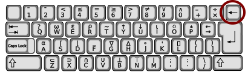

```{r setup, include=FALSE}
library(learnr)
library(tidyverse)
library(lubridate) #时间数据处理
library(gapminder) 
```

# 数据输入／输出

## 导语

大家好，我是萌萌！欢迎来到“Learning R with Dr. Hu and His Friends”!

现在你进入的是通往`R expert`之路的第一站，我将和胡老师一起引领你走入R的世界，领略其中风采。

希望这节课能让你初步了解R语言的**说话风格**！对，就是“说话风格”——R作为一种编程语言，本质上就是一种与计算机对话的方式。
我们常见的C++, Java和Python也是如此。
了解一种语言的“说话方式”的特点有助于我们更好的通过它与计算机进行“**沟通**”。

## 知识点

### 对象是什么？

R是对象指向型编程（Object-oriented programming）语言。
这类语言的基本操作单位是类（class）和对象（object）。
其中，类是概括性的，规定了其所属对象的属性类型，是其所辖对象的模板，比如在`国家`这一类下，所有个体都包含人口、疆域、政权类型等属性。
对象是类模板的一个具象，比如基于`国家`类可以创建的对象`中国`、`法国`、`爱尔兰`等。


### 函数是什么？

```{r out.width = "80%", echo = FALSE}
knitr::include_graphics("images/handShadow.gif")
```

```{r funIllustration, eval = FALSE}
light <- function(finger){
  {{shadow <- finger + 5}}
}
handShadow <- light(finger = 3)
handShadow
```

### 数据包是什么

数据包（package）相当于你智能手机里的app。
当你买到手机的时候，功能都是有限的。
通过app，你可以让手机的功能极大丰富起来。

###

本章节我们将要学习的知识点有以下几个方面：

1.  输入/输出数据
2.  保存数据
3.  合并数据

## 数据输入

### 对象赋值 `<-`

语法：<名称> `<-` <对象>

举例：

```{r object}
aValidObject <- 1:5
aValidObject # 展示对象内容
```

+ 命名规则
    1. 不要以数字开头 (错误: `1stday`)
    1. 除了 `.` 和 `-`以外没有其他特殊符号(错误: `M&M`)
    1. 区分大小写 (`X != x`) `!表示“非”/“否”，`!=`表示“不等于”
    1. 如需必要请勿重写内置函数 (避免: `list <- c(1:5)`)


### 另一种赋值符 `=`

用法和`<-`等效。
但更多写过更倾向使用 `<-` 而不是 `=`。

Why?

```{r out.width = "80%", echo = FALSE}

```

+ 指向直观

```{r arrow}
a <- 12
25 -> b
```

+ 不可以和“等于”混淆（本章最后一节会详述）
+ 可以通过快捷键一次性输入
    + PC: `Alt + -`
    + Mac: `option + -`


### 什么时候用 "="?
当你不想创建一个对象的时候,请看以下例子

```{r sideEffect, exercise = TRUE}
median(y <- 1:10); y
median(x = 1:10); x
```

### 挑战时间！

请创建一个合规和不合规的对象：

```{r objectEg, exercise = TRUE}
# 一个合规对象

# 试着创建一个不合规的对象

```

> 萌萌：对象赋值是R语言最基本的操作。我习惯简单把这个动作理解成给箭头右边的对象（一条或一组数据、一个数据结果、一幅图等等）取个名字，嘿嘿😋

## 数据读取

### 内置数据

```{r mtcars, exercise}
data(mtcars)
#data(gapminder::gapminder)
```

### 可直接读取数据

可读取数据类型

- `.RDS` (单一对象)
- `.RData` (多个对象)
- `.txt` 
- `.csv`

语法： <名称>`<-` <读取函数>(<数据路径>)

```{r input, eval = FALSE}
df_rds <- readRDS("aDataset.rds")
df_txt <- read.table("D:/aDataset.txt")
df_csv <- read.csv("./aDataset.csv")
```


### 调用包读取数据

通过`library`或者`require`调用数据包，然后使用其中的命令。


```{r eval=FALSE}
# SPSS, Stata, SAS
library(haven)
df_spss <- read_spss("<FileName>.sav")
df_stata <- read_dta("<FileName>.dta")
df_sas <- read_sas("<FileName>.sas7bdat")  

# 表格的快速导入
library（reader）
df_csv <- read.csv("<FileName>.csv")
df_table <- read.table("<FileName>.csv/txt")

# Excel表格
library(readxl)
df_excel <- read_excel("<FileName>.xls")
df_excel2 <- read_excel("<FileName>.xlsx")

# JSON (JavaScript Object Notation)
library(rjson)
df_json <- fromJSON(file = "<FileName>.json" )

# XML/Html
library(xml)
df_xml <- xmlTreeParse("<url>")
df_html <- readHTMLTable(url, which=3)
```


## 数据分类

1. 向量 (vector)
2. 矩阵 (matrix)
3. 数据框 (data frame)
4. 列表 (list)
5. 阵列 (array)


### 向量

向量（vector）是R语言中最基本的数据类型，执行组合功能的函数`c()`可用来创建向量

+ 数字向量（numeric vector）

```{r numeric, exercise = TRUE}
vec_num1 <- c(1, 2, 3) #整数
vec_num2 <- c(1:5) #表示1-5 
vec_num3 <- c(1.5, -2.34, NA)

vec_num1; vec_num2; vec_num3

# c(1.5:3) 的结果是什么?
```

注意: 1. `NA`表示的是: not available
      2. 单个向量中的数据必须拥有相同的类型（数值型、字符型或逻辑型）

###

+ 字符向量（character vector）

```{r character, exercise = TRUE}
vec_chr <- c("R is hard.", "But I can nail it.")
vec_chr
```

###

+ 逻辑向量（logic vector）

```{r logic, exercise = TRUE}
vec_tf <- c(TRUE, TRUE, FALSE)
vec_tf
# c(TRUE, TRUE, FALSE) == c(1, 1, 0)
```


###

+ 类别向量（factor vector）

```{r factor, exercise = TRUE}
vec_fac <- factor(c(1, 2, 2, 3), labels = c("Apple", "Pear", "Orange"))
vec_fac
levels(vec_fac)
```

水平(Levels)和标签(Lables)

```{r level, exercise = TRUE}
vec_fac2 <- factor(c(1, 2, 2, 3), levels = c(3, 2, 1), labels = c("Apple", "Pear", "Orange"))
vec_fac2
```

> 萌萌：你可以通过`?factor`和[`forcats`手册](https://forcats.tidyverse.org/)了解更多关于类别变量的知识。

###

+ 时间向量（POSIXct/POSXlt vector）

`as.POSIXct` (numeric input), `as.POSIXlt` (character input)
其中POSIXct是整数存储、POSIXlt是列表存储
```{r time, exercise}
Sys.time() # 获取当前时间
today()   # 获取当日的 年月日
now()  # 获取当日的 年月日 时分秒  时区
# CST为操作时电脑ip所在的时区

# The full pack
time1 <- Sys.time()
time2 <- as.POSIXlt(Sys.time())
time2$wday # week of the day

## 如果我只在乎日期呢？
```

```{r time-solution}
Sys.Date()
date1 <- as.Date("2019-01-02")
class(date1)  # 查看数据类型
```

###

+ 时间处理包`lubridate`
    1. 实时获取日期型数据和日期时间型数据
    2. 自定义生成公式化的日期数据
    3. 实现日期型数据和日期时间型数据的转化
    4. 列出提取Date类中的年月日时分秒等元素

### 矩阵

矩阵（matrix）是具有维度属性的向量，矩阵都是二维的，和向量类似，矩阵中也仅能包含一种数据类型

```{r out.width = "80%", echo = FALSE}
knitr::include_graphics("images/matrix.gif")
```

###

创建矩阵主要有三种方法：

+ 手动创建: `matrix`
```{r matrixR}
A <- matrix(1:20, ncol = 4) #创建一个数字1-20，5行4列的矩阵（col为列，row为行）
A
A[2, 3]
```

###

+ 矢量+维度: `dim()`
```{r}
M <- c(1:20)
dim(M) <- c(4,5) #4行5列       
M
```

###

+ 绑定行/列: `cbind()`和`rbind()`
```{r}
x <- 1:4
y <- 5:8
cbind (x, y)
rbind (x, y)
```

### 阵列

阵列，顾名思义就是列的“阵”，可用于记录更高维度的数据，可通过`array`函数创建。

```{r array}
# 创建两个长度不同的向量。
vector1 <- c(5,9,3)
vector2 <- c(10,11,12,13,14,15)

# 把这些向量输入到数组中。
result <- array(c(vector1,vector2),dim = c(3,3,2))
result
```

### 列表

列表（list）是一种可包含多种不同类型对象的向量，是一些对象（或成分，component）的有序集合，列表中既可以有向量也可以有矩阵等。

```{r list}
ls_monks <- list(name = c("Wukong Sun", "Sanzang Tang", "Wuneng Zhu", "Wujing Sha"),
                 power = c(100, 20, 90, 40),
                 buddha = c(TRUE, TRUE, FALSE, FALSE))

ls_monks
```

### 数据框

数据框（Data Frame）是一种特殊的列表/矩阵，其中所用元素长度都相等，列表中的每个元素都可以看作一列，每个元素的长度可以看作行数。

在Excel中:

```{r excel, out.width = "80%", echo = FALSE}
knitr::include_graphics("images/excel-r1.png")
```

在R中，使用`data.frame()`创建数据框

```{r dataframe}
df_toy <- data.frame(female = c(0,1,1,0),
           age = c(29, 39, 38, 12),
           name = c("Iron Man", "Black Widow", "Captain Marvel", "Captain America"))

df_toy
```

在Rstudio中:

```{r rstudio}
knitr::include_graphics("images/excel-r2.png")
```


## 合并数据

### 
我们采用瑞典学者Hans Rosling在[TED 演讲](https://www.ted.com/talks/hans_rosling_shows_the_best_stats_you_ve_ever_seen?utm_campaign=tedspread--b&utm_medium=referral&utm_source=tedcomshare)中使用的人口数据作为案例来进行下面的讲述。
让我们首先来看看数据

```{r toy}
library(gapminder)
gapminder
```

### 行合并

```{r out.width = "95%", echo = FALSE}
knitr::include_graphics("images/rowBind.png")
```

假设我们有亚洲和欧洲人口数据，如何把它们合并在一起呢？

```{r ex_append, exercise = TRUE, exercise.eval = TRUE}
gapminder_asia <- gapminder[gapminder$continent == "Asia", 1:2]
gapminder_europe <- gapminder[gapminder$continent == "Europe", 1:2]
```

```{r ex_append-solution}
library(dplyr)

gapminder_eurasia <- bind_rows(gapminder_asia, gapminder_europe) #按行连接，不需要列名相同
```

### 列合并

如果我们有一系列的变量，都是来自同一组国家的，如何把他们整合在一起？

```{r out.width = "95%", echo = FALSE}
knitr::include_graphics("images/columnBind.png")
```

```{r ex_columnBind, exercise = TRUE}
gapminder_country <- gapminder$country
gapminder_year <- gapminder$year
```

```{r ex_columnBind-solution}
bind_cols(gapminder_country, gapminder_year) #按列结合时需要行名相同
```

### 索引合并

`dplyr::*_joint`函数

```{r out.width = "95%", echo = FALSE}
knitr::include_graphics("images/join.png")
```

1. 左连接（left_jion): 保留x中的所有观测,如果x中的key变量,在y中有多个同样的key,那么所有的结合可能都会罗列出来。

```{r left_jion, eval=FALSE}
left_join(x, y, by = "key")
```

2. 右连接(right_jion): 保留 y 中的所有观测

```{r right_jion, eval=FALSE}
right_join(x, y, by = "key")
```

### 挑战时间

如果我们有两组数据分别来自不同的源头，又有不同的行数，该如何把它们准确的合并在一起呢？

```{r ex_join, exercise = TRUE}
gapminder_country <- select(gapminder, country, year)
gapminder_year <- select(gapminder, year, pop)
```

```{r ex_join-solution}
gapminder_countryYear<- left_join(gapminder_country, gapminder_year)
```

> 萌萌：在操作上，行合并的关键是每行都有相同的列，列合并则需要每列行数相同。索引合并时，一定要确定两个数据的索引内容是能很好对应的，否则后果惨烈……请不要问我是怎么知道的~

## 数据输出

语法：<函数>(<代存数据>，file = <存储路径>)

### 储存为R数据

```{r saving, eval = FALSE}
saveRDS(gapminder_country, file = "gapminder_country.rds")
save(gapminder_country, gapminder_year, file = "gapminder.rdata")
```


### 储存为csv文件

```{r savingCSV, eval = FALSE}
write.csv(gapminder_country, file = "gapminder_country.csv")
```

提示: 如果你的数据是中文的，可能会出现存储csv乱码现象。
这个我们之后遇到时候再讲解。

当然了，你可以把数据以STATA, SPSS, Excel格式存储下来, 不过你真的想这样吗？

### 体面地储存数据

STATA (.dta, \<14): 3.16 G = R (.rds): 0.05 G

| **Method**       | **Average Time** | **Minimum** | **Maximum** |
|:-----------------|:----------------:|:-----------:|:-----------:|
| base::readRDS    |       19.65      |    18.64    |    21.01    |
| fst::read\_fst   |       1.39       |     0.56    |     3.41    |
| haven::read\_sav |      104.78      |    101.00   |    111.85   |
| qs::qread        |       3.33       |     3.00    |     4.24    |

: 四种在R中读取GSS数据的方式所用的平均时间（以秒计）

| **Method**      | **Average Time** | **Minimum** | **Maximum** | **File Size** |
|:----------------|:----------------:|:-----------:|:-----------:|:-------------:|
| base::saveRDS   |       98.36      |    93.09    |    103.24   |    30.9 MB    |
| fst::write\_fst |       2.70       |     1.86    |     4.05    |    122.1 MB   |
| qs::qsave       |       5.03       |     4.35    |     6.62    |    44.6 MB    |

: 在R中写入GSS数据（及文件大小）所用的平均时间


## 数学计算

```{r math, exercise = TRUE}
x <- y <- 42

# 基础数学
x + (1 - 2) * 3 / 4

# 高等数学
x^2;sqrt(x);log(x);exp(x)

# 矩阵运算
z <- matrix(1:4, ncol = 2)
z + z - z
z %*% z  # inner multiplication
z %o% z  # outter multiplication

# 布尔逻辑计算
x == y; x != y
x & y; x | y
x > y; x <= y
```

在[这里](https://towardsdatascience.com/intro-to-r-linear-algebra-2a4de2506c93)查看更多线性代数在 R 中的应用。

## 总结

1. 输入
    + `readTYPE`
    + `read_type`
    + `read.type`
1. 保存
    + 向量
    + 矩阵/data.frame
    + 列表, 数组
1. 输出
    + `save`
    + `saveTYPE`

### 感谢聆听，下次再见！

<i class="fa fa-envelope fa-lg"></i> <yuehu@tsinghua.edu.cn>

<i class="fa fa-globe fa-lg"></i> <https://sammo3182.github.io/>

<i class="fab fa-github fa-lg"></i> [sammo3182](https://github.com/sammo3182)