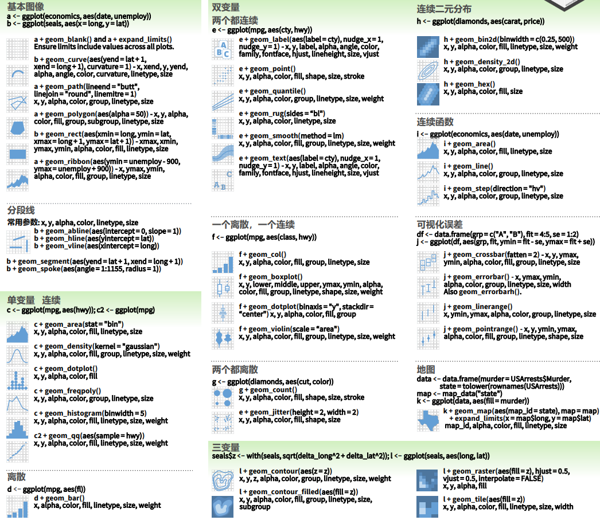

<!-- 宇飞，请检查编码是否可以运行 -->


```{r setup, include=FALSE}
knitr::opts_chunk$set(echo = TRUE,
                      message = FALSE,
                      warning = FALSE,
                      out.width="100%")

if (!require(pacman)) install.packages("pacman")
if(!require(ggradar)) devtools::install_github("ricardo-bion/ggradar", dependencies = TRUE)

p_load(
  scales,
  tidyverse,
  drhur,
  ggside
)

wvs7_narm <-
  filter(wvs7,
         if_all(c(incomeLevel, education, religious), ~ !is.na(.)))

set.seed(114)
```

# 数据可视化

## 知识点
- 研究问题：
 **经济不平等会带来怎样的社会政治影响呢？** 
    -  经济不平等会影响受教育水平吗？
        - 家庭的经济状况是如何影响平均受教育水平的呢？
        - 家庭是否信仰宗教是否会使家庭的经济状况对平均教育水平的影响发生改变吗？
    -  经济不平等会影响政治信任吗？
       - 家庭收入水平怎么影响个体对国家机制（政府、法庭、议会、军队、媒体）的信任呢？

    

- Build-in可视化
- `lattice`
- `ggplot`

## 演示数据

我们在这部分依旧使用WVS7的一个样本进行演示。
具体变量信息可通过`?drhur::wvs7`查看。

```{r wvs7}
library(drhur)
data("wvs7")
```

## 可视化引擎

在R语言中，可以通过三种引擎实现数据可视化：

- Build-In引擎
- `lattice`引擎
- `ggplot2`引擎

我们下面基于散点图进行演示。
我们关注的实际问题是：不同年龄层的人群对收入分配的看法是否有所不同。
对于收入看法，我们采用`wvs7`中的`equalIncentive`来测量。

## Build-In可视化

Build-in 可视化引擎是R自带的可视化方式，不用调用任何软件包即可使用，它有以下特点：

**优点**

* 不用安装
* 反应迅速
* 很多3D和空间视图的基础

**缺点**

* 不精致
* 灵活性差

### 家境-教育关系散点图

```{r scatterBasic, exercise=TRUE}
plot(wvs7$incomeLevel, wvs7$education)

## 添加装饰
```

```{r scatterBasic-solution}
plot(
  wvs7$incomeLevel, wvs7$education,
  main = "Family Income and Education",
  xlab = "Family Income",
  ylab = "Education Level"
)

abline(lm(education ~ incomeLevel, data = wvs7), col = "red") # regression
lines(lowess(wvs7$incomeLevel, wvs7$education, delta = 0.01 * diff(range(wvs7$age, na.rm = TRUE))), col = "blue") # lowess line (x,y)
```


### 保存输出

* 兼容模式:`.jpg`, `.png`, `.wmf`, `.pdf`, `.bmp`, and `postscript`.
* 过程:
    1. 启用装置
    2. 画图
    3. 关闭装置

```{r saving, eval = FALSE}
png("scatterBasic.png")
plot(wvs7$incomeLevel, wvs7$education)
dev.off()
```

## `lattice`可视化

`lattice`是印度统计学院副教授Deepayan Sarkar发展的作图工具，旨在将“trellis graph”作图理念带入R可视化，优化R build-in作图引擎。
这个系列中，作图命令更加系统化，也拥有了更大的自由度：

```{r scatterLattice, exercise = TRUE}
library(lattice)

xyplot(education ~ incomeLevel, data = wvs7)
```

```{r scatterLattice-solution}
xyplot(
  education ~ incomeLevel,
  group = female,
  type = c("p", "g", "smooth"),
  main = "Family Income on Education",
  xlab = "Income",
  ylab = "Education",
  data = wvs7,
  auto.key = TRUE
)

xyplot(
  education ~ incomeLevel | religious,
  group = female,
  type = c("p", "g", "smooth"),
  main = "Family Income on Education",
  xlab = "Income",
  ylab = "Education",
  data = wvs7,
  auto.key = TRUE
)

cloud(education ~ incomeLevel * religious, data = wvs7)
```

### 现学现练
请以国家为分组，画出教育程度与收入的散点图。
```{r scatterLattice_exercise, exercise=TRUE}

```

```{r scatterLattice_exercise-solution}
xyplot(
  education ~ incomeLevel | country,
  layout=c(5,3),
  type = c("p", "g"),
  main = "Family In come on Education",
  xlab = "Income",
  ylab = "Education",
  data = wvs7,
  auto.key = TRUE
)

```


## `ggplot2`可视化

`ggplot2`引用了更加系统化的可视化理论，即Leland Wilkinson的*The Grammar of Graphics*，从底层逻辑上对R语言可视化进行了改革。
现在这种可视化语法也成为了R语言领域最流行，发展也最迅速的可视化手段。

```{r install, eval=FALSE}
install.packages("ggplot2")
library(ggplot2)
```

### `ggplot`核心概念

* `mapping`: 美观映射 (`aes`, `alpha`)---颜色, 形状, 大小等。
    + 从一幅图中可以感知到的性质。
    + 每一种美观性可以被映射到一个变量，或是被设置成一个常量。
* `geom_*`: 几何对象---点, 线, 条等，用于规定数据的呈现方式。   
  {width=100%}


### 万能模板

```{r basic, eval = FALSE}
ggplot(data = <数据>) +
  geom_<形状1>(
    mapping = aes(x = <横轴变量>, y =  <纵轴变量>,
                  color = <边框颜色>,
                  fill = <填充颜色>,
                  size  = <粗细大小>,
                  ......),
    alpha  = <透明度，0--1>
  ) + 
  geom_<形状2> + 
  <标度、坐标系统、配色主题>... 
```

### 应用案例

```{r eg, echo=FALSE}
# E.g. 1 ####
library(dplyr)
wvs7_narm <-
  filter(wvs7,
         if_all(c(incomeLevel, education, religious), ~ !is.na(.)))


library(ggside)
ggplot(data = wvs7_narm,
       aes(x = incomeLevel, y = education, color = religious)) +
    geom_point(size = 2, alpha = 0.3) +
    geom_smooth(aes(color = NULL), se=TRUE) +
    geom_xsidedensity(
        aes(
            y    = after_stat(density),
            fill = religious
        ),
        alpha    = 0.5,
        size     = 1
        ,
        position = "stack"
    ) +
    geom_ysidedensity(
        aes(
            x    = after_stat(density),
            fill = religious
        ),
        alpha    = 0.5,
        size     = 1
        ,
        position = "stack"
    ) +
    labs(title = "Economy on Education" ,
         subtitle = "Scatter plot + density distribution",
         x = "Family Income", y = "Education") +
  theme_minimal() +
    theme(
        ggside.panel.scale = 0.4
    )

# E.g. 2 ####
wvs7_agg <- group_by(wvs7_narm, incomeLevel, religious) %>% 
  summarise(mean_ed = mean(education), 
            sd_ed = sd(education),
            se_ed = sd_ed / sqrt(n()),
            lb_ed = mean_ed - stats::qnorm(1 - (1 - 0.95) / 2) * se_ed,
            ub_ed = mean_ed + stats::qnorm(1 - (1 - 0.95) / 2) * se_ed)

ggplot(wvs7_agg, aes(x = incomeLevel, y = mean_ed, fill = religious)) +
  geom_bar(stat = "identity",
           color = "black",
           position = position_dodge()) +
  geom_errorbar(aes(ymin = lb_ed, ymax = ub_ed),
                width = 0.2,
                position = position_dodge(.9)) +
  geom_point(
    data = wvs7_narm,
    aes(y = education, shape = religious),
    position = position_jitterdodge(),
    alpha = 0.3
  ) +
  labs(
    title = "Economy on Education over Culture" ,
    subtitle = "Mean Bar, Error Intervals, and Jitter Plots",
    x = "Family Income",
    y = "Education"
  ) +
  theme_minimal() +
  theme(legend.position = "top") +
  scale_fill_viridis_d()

# E.g. 3 ####
income_qnt <- quantile(wvs7$incomeLevel, seq(0, 1, .25), na.rm = TRUE)

wvs7_agg2 <- filter(wvs7, !is.na(incomeLevel)) %>%
  mutate(group = cut(incomeLevel, income_qnt, include.lowest = TRUE) %>% ordered(label = c(
    "Low", "Medium-Low", "Medium-High", "High"
  ))) %>%
  group_by(group) %>%
  summarise(across(
    c(
      confidence_armedForce,
      confidence_gov,
      confidence_court,
      confidence_parliament,
      confidence_tv
    ),
    mean,
    na.rm = TRUE
  )) %>%
  mutate(across(-group, rescale)) %>%
  rename(
    Military = confidence_armedForce,
    Government = confidence_gov,
    Court = confidence_court,
    Parliament = confidence_parliament,
    TV = confidence_tv
  )

library(ggradar)

wvs7_agg2 %>% 
  ggradar(
    axis.label.size = 2,
    group.point.size = 0.5,
    group.line.width = 1,
    grid.label.size = 3,
    fill = TRUE,
    fill.alpha = 0.3,
    plot.title = "Economy on Institutional Confidence"
  ) +
  theme_minimal() +
  theme(legend.position = "bottom") +
  facet_wrap(~ group, ncol = 4)
```


### 案例1

散点图：经济和文化因素对个体教育水平的影响

> 要点：ggplot作图和我们常见的PS修图很像，先把基本图做出来，然后一层一层叠加滤镜效果。

```{r scatterSteps, exercise = TRUE}
wvs7_narm <-
  filter(wvs7,
         if_all(c(incomeLevel, education, religious), ~ !is.na(.)))

ggplot(data = wvs7_narm,
       aes(x = incomeLevel, y = education, color = religious))
```

```{r scatterSteps-solution}
ggplot(data = wvs7_narm,
       aes(x = incomeLevel, y = education, color = religious)) +
    geom_point(size = 2, alpha = 0.3) +
    geom_smooth(aes(color = NULL), se=TRUE) +
    geom_xsidedensity(
        aes(
            y    = after_stat(density),
            fill = religious
        ),
        alpha    = 0.5,
        size     = 1
        ,
        position = "stack"
    ) +
    geom_ysidedensity(
        aes(
            x    = after_stat(density),
            fill = religious
        ),
        alpha    = 0.5,
        size     = 1
        ,
        position = "stack"
    ) +
    labs(title = "Economy on Education" ,
         subtitle = "Scatter plot + density distribution",
         x = "Family Income", y = "Education") +
  theme_minimal() +
    theme(
        ggside.panel.scale = 0.4
    )
```


### 案例2

柱状图：经济对平均教育水平的影响在文化因素上的差异性

> 要点：每一种图形属性都有一个默认的标尺，在作图中标尺不仅可以用来改换比例，也可以用来更改颜色。

```{r barSteps, exercise = TRUE}
wvs7_agg <- group_by(wvs7_narm, incomeLevel, religious) %>% 
  summarise(mean_ed = mean(education), 
            sd_ed = sd(education),
            se_ed = sd_ed / sqrt(n()),
            lb_ed = mean_ed - stats::qnorm(1 - (1 - 0.95) / 2) * se_ed,
            ub_ed = mean_ed + stats::qnorm(1 - (1 - 0.95) / 2) * se_ed)

ggplot(wvs7_agg, aes(x = incomeLevel, y = mean_ed, fill = religious))
```

```{r barSteps-solution}
wvs7_agg <- group_by(wvs7_narm, incomeLevel, religious) %>% 
  summarise(mean_ed = mean(education), 
            sd_ed = sd(education),
            se_ed = sd_ed / sqrt(n()),
            lb_ed = mean_ed - stats::qnorm(1 - (1 - 0.95) / 2) * se_ed,
            ub_ed = mean_ed + stats::qnorm(1 - (1 - 0.95) / 2) * se_ed)

ggplot(wvs7_agg, aes(x = incomeLevel, y = mean_ed, fill = religious)) +
  geom_bar(stat = "identity",
           color = "black",
           position = position_dodge()) +
  geom_errorbar(aes(ymin = lb_ed, ymax = ub_ed),
                width = 0.2,
                position = position_dodge(.9)) +
  geom_point(
    data = wvs7_narm,
    aes(y = education, shape = religious),
    position = position_jitterdodge(),
    alpha = 0.3
  ) +
  labs(
    title = "Economy on Education over Culture" ,
    subtitle = "Mean Bar, Error Intervals, and Jitter Plots",
    x = "Family Income",
    y = "Education"
  ) +
  theme_minimal() +
  theme(legend.position = "top") +
  scale_fill_viridis_d()
```


### 案例3

雷达图：家庭经济水平对个体机制信心的影响

> 要点：通过分面来凸显效果

```{r radarSteps, exercise = TRUE}
income_qnt <- quantile(wvs7$incomeLevel, seq(0, 1, .25), na.rm = TRUE)

wvs7_agg2 <- filter(wvs7, !is.na(incomeLevel)) %>%
  mutate(group = cut(incomeLevel, income_qnt, include.lowest = TRUE) %>% ordered(label = c(
    "Low", "Medium-Low", "Medium-High", "High"
  ))) %>%
  group_by(group) %>%
  summarise(across(
    c(
      confidence_armedForce,
      confidence_gov,
      confidence_court,
      confidence_parliament,
      confidence_tv
    ),
    mean,
    na.rm = TRUE
  )) %>%
  mutate(across(-group, rescale)) %>%
  rename(
    Military = confidence_armedForce,
    Government = confidence_gov,
    Court = confidence_court,
    Parliament = confidence_parliament,
    TV = confidence_tv
  )

library(ggradar)

wvs7_agg2 %>% 
  ggradar(
    axis.label.size = 2,
    group.point.size = 0.5,
    group.line.width = 1,
    grid.label.size = 3,
    fill = TRUE,
    fill.alpha = 0.3,
    plot.title = "Economy on Institutional Confidence"
  ) +
  theme_minimal() +
  theme(legend.position = "bottom")
```


```{r radarSteps-solution}
income_qnt <- quantile(wvs7$incomeLevel, seq(0, 1, .25), na.rm = TRUE)

wvs7_agg2 <- filter(wvs7, !is.na(incomeLevel)) %>%
  mutate(group = cut(incomeLevel, income_qnt, include.lowest = TRUE) %>% ordered(label = c(
    "Low", "Medium-Low", "Medium-High", "High"
  ))) %>%
  group_by(group) %>%
  summarise(across(
    c(
      confidence_armedForce,
      confidence_gov,
      confidence_court,
      confidence_parliament,
      confidence_tv
    ),
    mean,
    na.rm = TRUE
  )) %>%
  mutate(across(-group, rescale)) %>%
  rename(
    Military = confidence_armedForce,
    Government = confidence_gov,
    Court = confidence_court,
    Parliament = confidence_parliament,
    TV = confidence_tv
  )

wvs7_agg2 %>% 
  ggradar(
    axis.label.size = 2,
    group.point.size = 0.5,
    group.line.width = 1,
    grid.label.size = 3,
    fill = TRUE,
    fill.alpha = 0.3,
    plot.title = "Economy on Institutional Confidence"
  ) +
  theme_minimal() +
  theme(legend.position = "bottom") +
  facet_wrap(~ group, ncol = 4)
  
```

### 案例4

 
如果交叉分类得到许多个交叉组， 每组有一个数量需要展示， 用堆叠或者并排条形图可能过于复杂， 结果很难判读。

可以用x轴和y轴分别表示两种分类， 在坐标交叉处用色块颜色代表数量， 称为热力图。

比如，现在想看一下不同教育程度、收入程度的人对政府信任的平均水平

```{r heatmap, exercise = TRUE}
wvs7 %>%
  select(education, incomeLevel, confidence_gov) %>%
  group_by(education,incomeLevel) %>%
  summarise(confidence_gov = median(confidence_gov, na.rm=TRUE)) %>%
  ungroup() -> wvs7_confidence
```

```{r  heatmap-solution}
wvs7 %>%
  select(education, incomeLevel, confidence_gov) %>%
  group_by(education,incomeLevel) %>%
  summarise(confidence_gov = median(confidence_gov, na.rm=TRUE)) %>%
  ungroup() -> wvs7_confidence

p <- ggplot(data = wvs7_confidence, mapping = aes(
  x = education, y = incomeLevel, fill = confidence_gov))
p + geom_tile() +
  scale_fill_viridis_c()
```


### 总结与补充

* `data`: 你想要可视化的数据
* `aes`: 美学映射
* `geoms`: 几何对象
* `labs`:
    + `title, subtitle`: 标题
    + `x, y`: 坐标轴标签
    + `caption`: 注释
* `theme`: 背景
+ `scales`: 将数据与映射联系起来
    + `facet`: 一个构面规范描述了如何将数据分解为集合
    + `coord`: 一个描述数据坐标如何映射到图形平面的坐标系统
+ `stats`: 统计转换


### 保存输出

* `ggsave(<plot project>, "<name + type>")`:
    + 当省略`<plot project>`时，R将保存最后显示的图。
    + 用户还可以使用其他参数来调整大小，路径，比例等。

```{r save, eval = FALSE}
ggsave("cfr.png")
```


## 最后的嘱咐

1. 好看 &prop; 复杂性。
1. 更酷炫不意味着更好。

