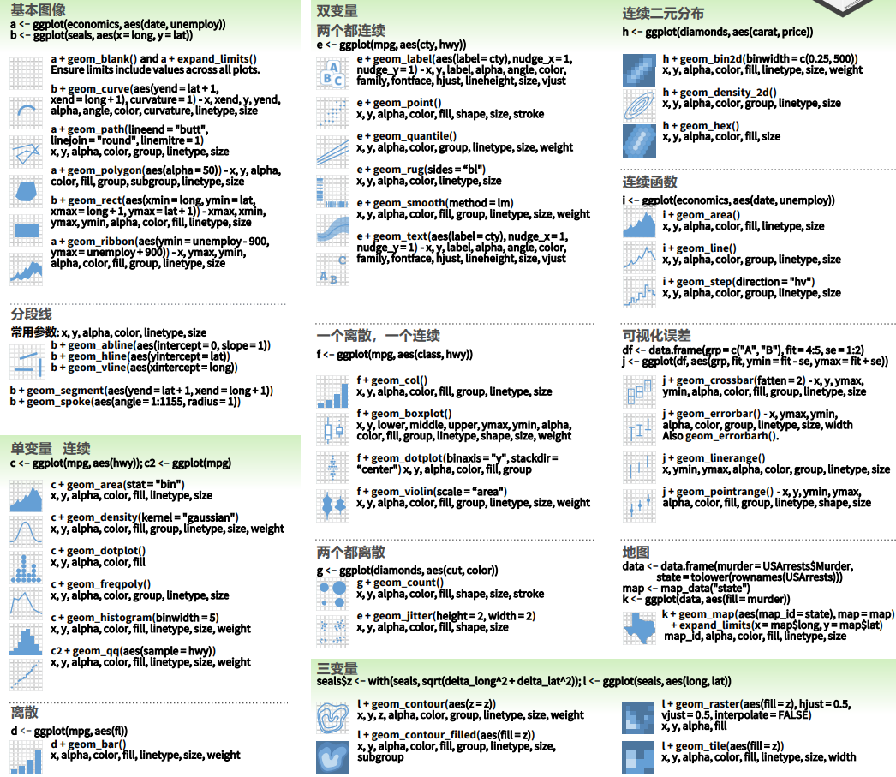

```{r setup, include=FALSE}
knitr::opts_chunk$set(echo = TRUE, message = FALSE, warning = FALSE)

library(learnr)
library(ggthemes) 
library(scales)
library(modelsummary)
library(dotwhisker)
library(interplot)
library(likert)
library(tidyverse)
library(gapminder)


set.seed(114)
```

# 数据可视化

## 知识点

- 自带可视化
- `ggplot`
    - 基础语法
    - 绘图与变换
    - 功能扩展

## 演示数据

我们在这部分依旧使用WVS7的一个样本进行演示。
具体变量信息可通过`?drhur::wvs7`查看。

```{r wvs7}
library(drhur)
data("wvs7")
```

在网络和地图绘制过程中，还会用到一些软件包自带的数据。
因为只要安装了软件包就能使用，待到相关章节我们再做介绍。

## 知识点

+ 什么是数据可视化？

数据可视化指将数字记录间**关系**以二维或三维图具象化的技术。

###

+ *The Grammar of Graphics* 

Leland Wilkinson创造的针对几乎所有类型定量可视化系统的基础总结，试图探究数据可视化的底层结构。在R中最流行的可视化包`ggplot2`，就是对这一理论系统的全面呈现。

### 

+ 可视化类型

1. <span style="color:goldenrod">统计可视化</span>
    + 描述性~
    + 分析~
1. 网络可视化
    + 图表 ([`DiagrammeR`](https://rich-iannone.github.io/DiagrammeR/docs.html), [`semPlot`](http://sachaepskamp.com/semPlot/examples))
    + 节点-连线
1. 地图

## R可视化引擎

* 基本图表: `plot()`
* 栅栏图: e.g., `ggplot()`
* 交互式图表: `shiny()` (今天先不讨论)

###

### 基本图表

```{r basePlot}
hist(mtcars$mpg)
```

**优点**

* R中自带
* <span style="color:goldenrod">探索数据</span>的优良工具。
+ <span style="color:goldenrod">空间</span>分析和 <span style="color:goldenrod">3-D</span>图。

**缺点**

* 不精致
* 灵活性差

**保存输出**

* 兼容模式:`.jpg`, `.png`, `.wmf`, `.pdf`, `.bmp`, and `postscript`.
* 过程:
    1. 启用装置
    2. 画图
    3. 关闭装置

```{r saving, eval = FALSE}
png("<working directory>/histgraph.png")
hist(mtcars$mpg)
dev.off()
```

### `ggplot`

在Leland Wilkinson的 *Grammar of Graphics*基础上创建。

* 为了使用 `ggplot` 函数, 你需要安装`ggplot2`.


```{r install, eval=FALSE}
install.packages("ggplot2")

# Or the development version from GitHub:
devtools::install_github("tidyverse/ggplot2")
```

## `ggplot`核心概念

* `mapping`: 美观映射 (`aes`, `alpha`)---颜色, 形状, 大小
    + 从一幅图中可以感知到的性质。
    + 每一种美观性可以被映射到一个变量，或是被设置成一个常量。
* `geom_`: 几何图案---点, 线, 条
    + 四十余种

```{r out.width = "100%", echo = FALSE}

```

## 万能模板

```{r basic, eval = FALSE}
ggplot(___) +
  geom_point(
    mapping = aes(x = ___, y = ___,
                  color = ___,
                  size  = ___),
    alpha  = ___
  )
```

> 萌萌：其实ggplot作图和我们常见的PS修图很像，先把基本图做出来，然后一层一层叠加滤镜效果。

## 描述可视化

一生二，二生三，三生万张图。

此次课程我们将用以下三个例子演示如何在R中进行统计分析。

1. Gapminder 2007 (点状图)
2. 新冠病毒致死率 (柱状图)
3. 新冠病毒潜伏期 (扇形图)

```{r goal-plots, results="hide", out.width="100%", echo=FALSE}
if (!require(ggplot2)) install.packages("ggplot2")
if (!require(scales)) install.packages("scales")
if (!require(ggthemes)) install.packages("ggthemes")
if (!require(gapminder)) install.packages("gapminder")

library(ggplot2) #主要绘图工具
library(ggthemes) #ggthemes是ggplot2的一个扩展包，提供一些额外的themes、geoms、scales。
library(scales)
library(gapminder) 

gapminder_2007 <- filter(gapminder, year == 2007) #选出年份为2007年的数据

ggplot(gapminder_2007) +
  geom_point(aes(x = gdpPercap, y = lifeExp, size = pop,
                 color = continent),
             alpha = 0.5) #分别以人均GDP和生命预期为横纵轴，点的大小表示人口规模，点的颜色表示所在大洲，透明度为0.5

ggplot(cfr_china, aes(x=age, y=cfr, group=1)) +
  geom_line() + #折线图
  geom_hline(yintercept = 0.01 * 2.3, linetype="dashed", alpha=0.5) + #添加横线
  geom_bar(aes(width=cases/10000, fill=age), stat = "identity", position = "identity") + #柱状图
  geom_text(aes(label=paste0(cfr*100,"%")), family="Palatino", size=3, nudge_y = 0.04) + #添加文本，其中family表示字体，size为字体大小
  geom_text(aes(label=paste0("(",deaths,"/",cases,")")), family="Palatino", size=3, nudge_y = 0.03) +
  scale_y_continuous(labels = percent) +
  scale_fill_tableau(palette = "Classic 10 Medium") +
  labs(title = "COVID-19 Case Fatality Rate (CFR) by Age Groups",
       subtitle = "Among 44,672 confirmed cases in China through February 11\nOverall CFR = 2.3% (dotted line)", #添加标题
       x = "Age Group", y = NULL,
       caption = "Source: Characteristics of and Important Lessons From the Coronavirus Disease 2019 (COVID-19) Outbreak in China:\nSummary of a Report of 72314 Cases From the Chinese Center for Disease Control and Prevention. Wu Z, McGoogan JM. JAMA. 2020\nhttps://jamanetwork.com/journals/jama/fullarticle/2762130 and http://weekly.chinacdc.cn/en/article/id/e53946e2-c6c4-41e9-9a9b-fea8db1a8f51") +
  theme_minimal(base_size = 14, base_family = "Palatino") +
  theme(plot.caption = element_text(face = "italic", size=6),
        legend.position = "none") #主题


ggplot(incubation_data, aes(ymax = svalue, ymin = 0, xmax = 2, xmin = 1, fill = sname)) +
  geom_rect(aes(ymax=14, ymin=0, xmax=2, xmin=1), fill ="#ece8bd") +
  geom_rect() +
  coord_polar(theta = "y",start=-pi/2) +
  xlim(c(0, 2)) + ylim(c(0,28)) +
  scale_fill_few(palette = "Medium") +
  scale_color_few(palette = "Medium") +
  geom_text(aes(x = 0, y = 0, label=stext, colour=sname), size=4, family="Palatino") +
  facet_wrap(~sname, ncol = 3) + #分面
  guides(fill=FALSE, colour=FALSE) +
  labs(title="COVID-19 Incubation Time",
       subtitle = "Time before infected person becomes symptomatic\n (percentiles and mean) ",
       caption = "Source: COVID-19 Incubation Period: An Update. Stephen G. Baum, MD\n reviewing Lauer SA et al. Ann Intern Med 2020 Mar 10\nhttps://www.jwatch.org/na51083/2020/03/13/covid-19-incubation-period-update",
       x=NULL, y=NULL) +
  theme_tufte(ticks = FALSE, base_size = 12, base_family = "Palatino") +
  theme(axis.text = element_blank(),
        plot.caption = element_text(face = "italic", size=6),
        strip.text = element_text(size = 12))
```


## 案例1: 图形属性

```{r pointGoal,echo=FALSE}
library(gapminder)

gapminder_2007 <- filter(gapminder, year == 2007)

ggplot(gapminder_2007) +
  geom_point(aes(x = gdpPercap, y = lifeExp, size = pop,
                 color = continent),
             alpha = 0.5)
```


### 搭建拆解

```{r point, exercise = TRUE}
library(gapminder)

gapminder_2007 <- filter(gapminder, year == 2007)

ggplot(gapminder_2007) +
  geom_point(aes(x = gdpPercap, y = lifeExp))
```

```{r point-solution}
# 调整颜色
ggplot(gapminder_2007) +
  geom_point(aes(x = gdpPercap, y = lifeExp,
                 color = continent))

ggplot(gapminder_2007) +
  geom_point(aes(x = gdpPercap, y = lifeExp,
                 color = pop))

# 调整大小
ggplot(gapminder_2007) +
  geom_point(aes(x = gdpPercap, y = lifeExp,
                 size = pop)) +
  scale_size_area(max_size = 10)

# 调整透明度
ggplot(gapminder_2007) +
  geom_point(aes(x = gdpPercap, y = lifeExp, size = pop),
             alpha = 0.5)

# 组合

ggplot(gapminder_2007) +
  geom_point(aes(x = gdpPercap, y = lifeExp, size = pop,
                 color = continent),
             alpha = 0.5)
```

> 萌萌：可以看出，一张统计图形是由从数据到几何对象（geometric object，记为geom，如点，线，条形等），图形属性（aesthetic attributes，记为aes，如颜色，形状，大小）的一个映射。这些组件之间通过“+”, 以图层(layer)的方式来粘合构图。

## 案例2: 几何图层

```{r cfr-df, echo = FALSE}
# Case Fatality Rate

cfr_china
```

```{r cfr-plot, echo = FALSE}
if (!require(ggplot2)) install.packages("ggplot2")
if (!require(scales)) install.packages("scales")
if (!require(ggthemes)) install.packages("ggthemes")

library(ggplot2)
library(scales)
library(ggthemes)

ggplot(cfr_china, aes(x=age, y=cfr, group=1)) +
  geom_line() +
  geom_hline(yintercept = 0.01 * 2.3, linetype="dashed", alpha=0.5) +
  geom_bar(aes(width=cases/10000, fill=age), stat = "identity", position = "identity") +
  geom_text(aes(label=paste0(cfr*100,"%")), family="Palatino", size=3, nudge_y = 0.04) +
  geom_text(aes(label=paste0("(",deaths,"/",cases,")")), family="Palatino", size=3, nudge_y = 0.03) +
  scale_y_continuous(labels = percent) +
  scale_fill_tableau(palette = "Classic 10 Medium") +
  labs(title = "COVID-19 Case Fatality Rate (CFR) by Age Groups",
       subtitle = "Among 44,672 confirmed cases in China through February 11\nOverall CFR = 2.3% (dotted line)",
       x = "Age Group", y = NULL,
       caption = "Source: Characteristics of and Important Lessons From the Coronavirus Disease 2019 (COVID-19) Outbreak in China:\nSummary of a Report of 72314 Cases From the Chinese Center for Disease Control and Prevention. Wu Z, McGoogan JM. JAMA. 2020\nhttps://jamanetwork.com/journals/jama/fullarticle/2762130 and http://weekly.chinacdc.cn/en/article/id/e53946e2-c6c4-41e9-9a9b-fea8db1a8f51") +
  theme_minimal(base_size = 14, base_family = "Palatino") +
  theme(plot.caption = element_text(face = "italic", size=6),
        legend.position = "none")
```

>萌萌：`ggplot2`提供了`ggtitle()`, `xlab()`和`ylab()`来显示出图标题，x轴，y轴。除此之外，我们可以通过`theme()`函数
根据需要来改变字体，字体大小，坐标轴，背景等各种元素。如,`theme_grey()`为默认主题，`theme_bw()`为白色背景的主题。

### 搭建拆解

```{r steps, exercise = TRUE}
if (!require(ggplot2)) install.packages("ggplot2")
if (!require(scales)) install.packages("scales")
if (!require(ggthemes)) install.packages("ggthemes")

library(ggplot2)
library(scales)
library(ggthemes)

ggplot(data = cfr_china,
       aes(x = age, y = cfr, group = 1))
```

```{r steps-solution}
ggplot(data = cfr_china,
       aes(x = age, y = cfr, group = 1)) +
  geom_bar(aes(width = cases / 10000, fill = age),
           stat = "identity",
           position = "identity") +
  geom_hline(yintercept = 0.01 * 2.3,
             linetype = "dashed",
             alpha = 0.5) +
  geom_line() +
  geom_text(
    aes(label = paste0(cfr * 100, "%")),
    family = "Palatino",
    size = 3,
    nudge_y = 0.04
  ) +
  geom_text(
    aes(label = paste0("(", deaths, "/", cases, ")")),
    family = "Palatino",
    size = 3,
    nudge_y = 0.03
  ) +
  scale_y_continuous(labels = percent) +
  scale_fill_tableau(palette = "Classic 10 Medium") +
  labs(
    title = "COVID-19 Case Fatality Rate (CFR) by Age Groups",
    subtitle = "Among 44,672 confirmed cases in China through February 11\nOverall CFR = 2.3% (dotted line)",
    x = "Age Group",
    y = NULL,
    caption = "Source: Characteristics of and Important Lessons From the Coronavirus Disease 2019 (COVID-19) Outbreak in China:\nSummary of a Report of 72314 Cases From the Chinese Center for Disease Control and Prevention. Wu Z, McGoogan JM. JAMA. 2020\nhttps://jamanetwork.com/journals/jama/fullarticle/2762130 and http://weekly.chinacdc.cn/en/article/id/e53946e2-c6c4-41e9-9a9b-fea8db1a8f51"
  ) +
  theme_minimal(base_size = 14, base_family = "Palatino") +
  theme(plot.caption = element_text(face = "italic", size = 6),
        legend.position = "none")
```

> 萌萌：每一种图形属性都有一个默认的标度,`scale_`便是将数据空间（标度的定义域）映射到图形属性空间（标度的值域）的常用函数。如，离散性数据的颜色图形属性默认标度名为`scale_colour_hue()`，形状图形属性标度为`scale_shape_shape()`。


### 初步总结

* `data`: 你想要可视化的数据
* `aes`: 美学映射
* `geoms`: 几何对象
* `labs`:
    + `title, subtitle`: 标题
    + `x, y`: 坐标轴标签
    + `caption`: 笔记
+ `stats`: 统计转换
+ `scales`: 将数据与映射联系起来
    + `coord`: 一个描述数据坐标如何映射到图形平面的坐标系统。
    + `facet`: 一个构面规范描述了如何将数据分解为集合。
* `theme`: 背景


### 保存输出

* `ggsave(<plot project>, "<name + type>")`:
    + 当省略`<plot project>`时，R将保存最后显示的图。
    + 用户还可以使用其他参数来调整大小，路径，比例等。

```{r save, eval = FALSE}
ggsave("cfr.png")
```

## 案例3: 新冠病毒潜伏期

```{r incubation-df, echo = FALSE}
incubation_data %>%
  mutate(sname = c("0%", "2.5%", "50%", "Average", "97.5%", "100%"),
         stext = str_sub(stext, start = 2))
```

```{r incubation-plot, echo = FALSE}
ggplot(incubation_data, aes(ymax = svalue, ymin = 0, xmax = 2, xmin = 1, fill = sname)) +
  geom_rect(aes(ymax=14, ymin=0, xmax=2, xmin=1), fill ="#ece8bd") +
  geom_rect() +
  coord_polar(theta = "y",start=-pi/2) +
  xlim(c(0, 2)) + ylim(c(0,28)) +
  scale_fill_few(palette = "Medium") +
  scale_color_few(palette = "Medium") +
  geom_text(aes(x = 0, y = 0, label=stext, colour=sname), size=4, family="Palatino") +
  facet_wrap(~sname, ncol = 3) +
  guides(fill=FALSE, colour=FALSE) + # removed the legend
  labs(title="COVID-19 Incubation Time",
       subtitle = "Time before infected person becomes symptomatic\n(percentiles and mean) ",
       caption = "Source: COVID-19 Incubation Period: An Update. Stephen G. Baum, MD\n reviewing Lauer SA et al. Ann Intern Med 2020 Mar 10\nhttps://www.jwatch.org/na51083/2020/03/13/covid-19-incubation-period-update",
       x=NULL, y=NULL) +
  theme_tufte(ticks = FALSE, base_size = 12, base_family = "Palatino") +
  theme(axis.text = element_blank(),
        plot.caption = element_text(face = "italic", size=6),
        strip.text = element_text(size = 12))
```

> 萌萌：`facet_wrap`和`facet_grid`是`ggplot2`常用到的分面函数，在数据对比以及分类显示上有着极为重要的作用。

### 搭建拆解

```{r incubation, exercise = TRUE}
ggplot(incubation_data,
       aes(
         ymax = svalue,
         ymin = 0,
         xmax = 2,
         xmin = 1,
         fill = sname
       ))
```

```{r incubation-solution}
ggplot(incubation_data,
       aes(
         ymax = svalue,
         ymin = 0,
         xmax = 2,
         xmin = 1,
         fill = sname
       )) +
  geom_rect(aes(
    ymax = 14,
    ymin = 0,
    xmax = 2,
    xmin = 1
  ), fill = "#ece8bd") +
  geom_rect() +
  coord_polar(theta = "y", start = -pi / 2) +
  xlim(c(0, 2)) + ylim(c(0, 28)) +
  scale_fill_few(palette = "Medium") +
  scale_color_few(palette = "Medium") +
  geom_text(aes(
    x = 0,
    y = 0,
    label = stext,
    colour = sname
  ),
  size = 4,
  family = "Palatino") +
  facet_wrap( ~ sname, ncol = 3) +
  guides(fill = FALSE, colour = FALSE) +
  labs(
    title = "COVID-19 Incubation Time",
    subtitle = "Time before infected person becomes symptomatic\n(percentiles and mean) ",
    caption = "Source: COVID-19 Incubation Period: An Update. Stephen G. Baum, MD\n reviewing Lauer SA et al. Ann Intern Med 2020 Mar 10\nhttps://www.jwatch.org/na51083/2020/03/13/covid-19-incubation-period-update",
    x = NULL,
    y = NULL
  ) +
  theme_tufte(ticks = FALSE,
              base_size = 12,
              base_family = "Palatino") +
  theme(
    axis.text = element_blank(),
    plot.caption = element_text(face = "italic", size = 6),
    strip.text = element_text(size = 12)
  )
```


## 分析可视化

* Likert量表
* 回归系数
* 交互效应
* 地图

###

```{r data-likert, echo=FALSE}
df_likert
```


## 案例1：Likert-Scale指数

```{r likert, exercise = TRUE, exercise.eval = TRUE}
if (!require(likert)) install.packages("likert")
library(likert)

likert(df_likert) %>%
  plot(type = "bar")
```

```{r likert-solution}
 likert(df_likert) %>%
  plot(
    type = "heat",
    low.color = "white",
    high.color = "blue",
    text.color = "black", 
    text.size = 4,
    wrap = 50
  )

likert(df_likert) %>%
  plot(type = "density",
       facet = TRUE,
       bw = 0.5)
```

## 案例2：回归结果

### 系数可视化

```{r m1}
m1 <- lm(mpg ~ cyl + gear + wt, data = mtcars) #进行OLS回归

summary(m1)
```

### 插播：制表之真Publishable

```{r modeltable}
library(modelsummary)
library(gt)

modelsummary(m1,
         stars = TRUE,
         title =  gt::md('This is *the* title'),
         subtitle = 'And a subtitle',
         output = "gt") %>% 
  tab_style(style = cell_fill(color = 'lightblue'),
              locations = cells_body(rows = 7:8))
```

> 萌萌：`modelssummary`可以自定义回归结果表中显示的信息。如，重命名、重新排序 选择要显示的拟合优度； 显示各种“稳健”标准误差或置信区间；添加标题、脚注或源注释； 插入星号或自定义字符以指示统计显着性水平。

```{r modelOut, eval = FALSE}
modelsummary(models, filename = 'table.tex')
modelsummary(models, filename = 'table.rtf')
modelsummary(models, filename = 'table.html')
modelsummary(models, filename = 'table.jpeg')
modelsummary(models, filename = 'table.png')
```

### Dot-whisker plot

```{r dotwhisker}
if (!require(dotwhisker)) install.packages("dotwhisker")
library(dotwhisker)

dwplot(m1)
```

> 萌萌：`dotwhisker`能够快速绘制回归结果图。

### 多重模型

```{r dwMulti, exercise = TRUE, exercise.eval = TRUE}
m2 <- lm(mpg ~ cyl + hp + wt + hp, data = mtcars)
m3 <- lm(mpg ~ cyl + hp + wt + hp + am, data = mtcars)

dwplot(list(m1, m2, m3)) #多个回归结果可视化
```

```{r dwMulti-solution}
dwplot(list(m1, m2, m3)) %>%
  relabel_predictors(
    c(
      wt = "Weight",
      cyl = "Cylinders",
      disp = "Displacement",
      hp = "Horsepower",
      gear = "Gears",
      am = "Manual"
    ) #重新命名纵轴
  ) +
  theme_bw() + xlab("Coefficient Estimate") + ylab("") + #添加横轴标题
  geom_vline(xintercept = 0, #在x=0出添加虚线
             colour = "grey60", #线的颜色
             linetype = 2) + #线的类型
  ggtitle("Predicting Gas Mileage") + #加入标题
  theme(
    plot.title = element_text(face = "bold"),
    legend.justification = c(0, 0),
    legend.position = c(0, 0),
    legend.background = element_rect(colour = "grey80"), 
    legend.title = element_blank() #去掉灰色网格
  )
```


### Small_multiple

```{r smallMultiple,eval=FALSE}
small_multiple(list(m1, m2, m3)) +
  ylab("Coefficient Estimate") +
  geom_hline(yintercept = 0,
             colour = "grey60",
             linetype = 2) +
  ggtitle("Predicting Gas Mileage") +
  theme(
    plot.title = element_text(face = "bold"),
    legend.position = "none",
    axis.text.x  = element_text(angle = 60, hjust = 1)
  )
```


## 案例3：交互效应

`interplot` 

用双向交互的方式可视化中一个变量的系数变化取决于另一个被包含的变量的值。

###

* （老营销style😏）惊天揭秘！单看显著性无法正确解释交互效应！
    + 模型: $$Y = \beta_0 + \beta_1X + \beta_2Z + \beta_3X\times Z + \varepsilon.$$
    + 影响: $$\frac{\partial Y}{\partial X} = \beta_1 + \beta_3Z.$$
    + 标准差: $$\hat{\sigma}_{\frac{\partial Y}{\partial X}} = \sqrt{var(\hat{\beta_1}) + Z^2var(\hat{\beta_3}) + 2Zcov(\hat{\beta_1}, \hat{\beta_3})}.$$

* 如何才能正确理解？
    + 最精确的方式: 计算平均数和标准差之间的差值。
    + 最方便的方式：把它可视化

### 绘制交互效应

```{r interact, exercise = TRUE, exercise.eval = TRUE}
m_cyl <- lm(mpg ~ wt * cyl, data = mtcars)
summary(m_cyl)
```

```{r interact-solution}
if (!require(interplot)) install.packages("interplot")
library(interplot)

interplot(m = m_cyl, var1 = "cyl", var2 = "wt")
interplot(m = m_cyl, var1 = "wt", var2 = "cyl")
```

### 实质显著性

```{r interHist}
interplot(m = m_cyl, var1 = "cyl", var2 = "wt", hist = TRUE) +
    geom_hline(yintercept = 0, linetype = "dashed")
```

### 类别比较

```{r interFactor}
mtcars$gear <- factor(mtcars$gear)
m_gear <- lm(mpg ~ gear * wt, data = mtcars)

interplot(m = m_gear, var1 = "wt", var2 = "gear")
```


## 网络可视化

```{r network}
if (!require(network)) install.packages("network")
if (!require(sna)) install.packages("sna")

library(network)
library(sna)
n <- network(rgraph(10, tprob = 0.2), directed = FALSE)

n %v% "family" <- sample(letters[1:3], 10, replace = TRUE)
n %v% "importance" <- sample(1:3, 10, replace = TRUE)

e <- network.edgecount(n)
set.edge.attribute(n, "type", sample(letters[24:26], e, replace = TRUE))
set.edge.attribute(n, "day", sample(1:3, e, replace = TRUE))

if (!require(ggnetwork)) install.packages("ggnetwork")
library(ggnetwork)

ggplot(n, aes(x = x, y = y, xend = xend, yend = yend)) +
  geom_edges(aes(linetype = type), color = "grey50") +
  geom_nodes(aes(color = family, size = importance)) +
  theme_blank()
```

## 地理可视化

```{r map, message=FALSE, cache=TRUE}
if (!require(ggmap)) install.packages("ggmap")
library(ggmap)

china <- c(left = 72, bottom = 0, right = 135, top = 52)

get_stamenmap(china, zoom = 5, maptype = "toner-lite") %>%
  ggmap()
```

> 萌萌：`ggmap`和`ggplot2`一样可以实现图形的分层语法，其基本思路是使用下载的地图图像，同时使用ggplot2将其作为背景层，然后在地图上绘制数据，统计信息或模型等图层。

## 总结

1. 好看 &prop; 复杂性。
1. 更酷炫不意味着更好。

