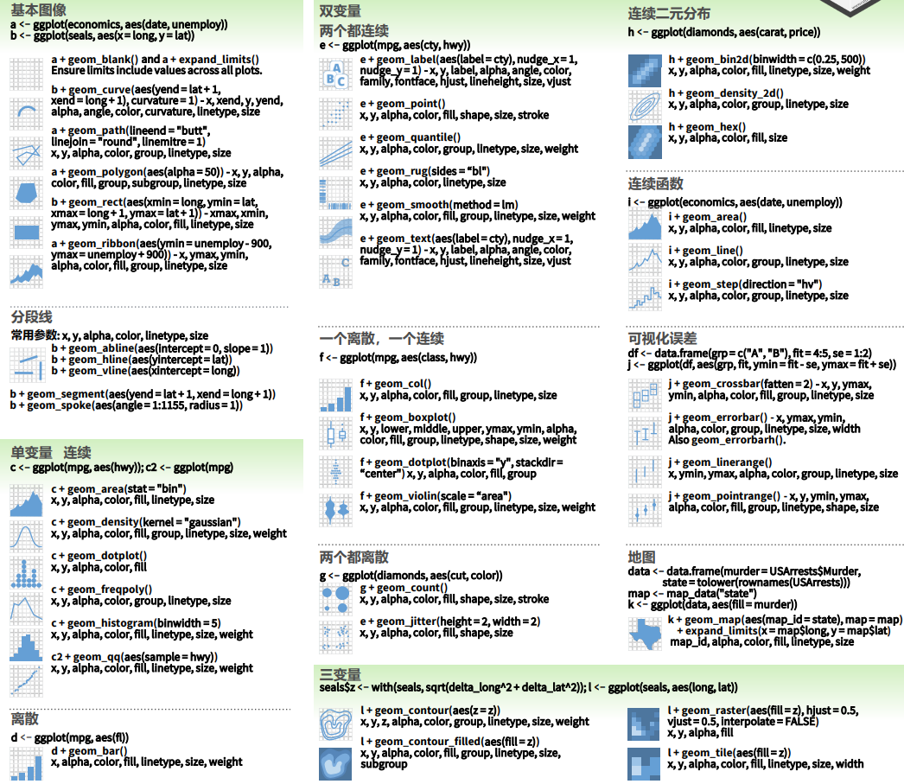

<!-- 宇飞，请检查编码是否可以运行 -->


```{r setup, include=FALSE}
knitr::opts_chunk$set(echo = TRUE,
                      message = FALSE,
                      warning = FALSE,
                      out.width="100%")

if (!require(pacman)) install.packages("pacman")
if(!require(ggradar)) devtools::install_github("ricardo-bion/ggradar", dependencies = TRUE)

p_load(
  scales,
  tidyverse,
  drhur,
  ggside
)

wvs7_narm <-
  filter(wvs7,
         if_all(c(incomeLevel, education, religious), ~ !is.na(.)))

set.seed(114)
```

# Data Visualization

## Key Points
- Research Question：
 **Does economic inequality affect educational levels?** 
    -  Does economic inequality affect educational levels?
        - How does the economic status of a household affect the average education level?
        - Does a family's religious belief change the impact of their economic status on the average education level?
    -  Does economic inequality affect political trust?
       - How does household income level affect an individual's trust in the state institutions (government, court, parliament, military, media)?


- Build-in Visualization
- `lattice`
- `ggplot`


## Sample Data

We still use a sample of WVS7 for demonstration in this part.
Specific variable information can be viewed through `?drhur::wvs7`.

```{r wvs7}
library(drhur)
data("wvs7")
```

## Visualization Engines

In the R programming language, there are three engines that can be used for data visualization:

- Build-In Engine
- `lattice` Engine
- `ggplot2` Engine

Below, we will demonstrate using a scatter plot. The practical problem we are interested in is whether different age groups have different views on income distribution. For income views, we use `equalIncentive` in `wvs7` to measure.


## Build-In Visualization

The Build-In visualization engine is a built-in visualization method in R that can be used without calling any software packages. It has the following characteristics:

**Advantages**

* No installation required
* Responds quickly
* Has a strong foundation in 3D and spatial views


**Disadvantages**

* Not very refined
* Poor flexibility
  
### Scatterplot of Family Wealth and Education Level

```{r scatterBasic, exercise=TRUE}
plot(wvs7$incomeLevel, wvs7$education)

## add decoration
```

```{r scatterBasic-solution}
plot(
  wvs7$incomeLevel, wvs7$education,
  main = "Family Income and Education",
  xlab = "Family Income",
  ylab = "Education Level"
)

abline(lm(education ~ incomeLevel, data = wvs7), col = "red") # regression
lines(lowess(wvs7$incomeLevel, wvs7$education, delta = 0.01 * diff(range(wvs7$age, na.rm = TRUE))), col = "blue") # lowess line (x,y)
```


### Save Output

* Compatibility modes: `.jpg`, `.png`, `.wmf`, `.pdf`, `.bmp`, and `postscript`.
* Process:
    1. Enable the device
    2. Drawing
    3. Turn off the device

```{r saving, eval = FALSE}
png("scatterBasic.png")
plot(wvs7$incomeLevel, wvs7$education)
dev.off()
```

## `lattice` Visualization

`lattice` is a plotting tool developed by Deepayan Sarkar, an associate professor at the Indian Statistical Institute, with the aim of bringing the "trellis graph" plotting concept into R visualization, optimizing R's built-in plotting engine.

In this series, the plotting commands are more systematic and have greater flexibility:

```{r scatterLattice, exercise = TRUE}
library(lattice)

xyplot(education ~ incomeLevel, data = wvs7)
```

```{r scatterLattice-solution}
xyplot(
  education ~ incomeLevel,
  group = female,
  type = c("p", "g", "smooth"),
  main = "Family Income on Education",
  xlab = "Income",
  ylab = "Education",
  data = wvs7,
  auto.key = TRUE
)

xyplot(
  education ~ incomeLevel | religious,
  group = female,
  type = c("p", "g", "smooth"),
  main = "Family Income on Education",
  xlab = "Income",
  ylab = "Education",
  data = wvs7,
  auto.key = TRUE
)

cloud(education ~ incomeLevel * religious, data = wvs7)
```

### Learning by Doing
Please group by country and plot a scatter plot of education level and income.
```{r scatterLattice_exercise, exercise=TRUE}

```

```{r scatterLattice_exercise-solution}
xyplot(
  education ~ incomeLevel | country,
  layout=c(5,3),
  type = c("p", "g"),
  main = "Family In come on Education",
  xlab = "Income",
  ylab = "Education",
  data = wvs7,
  auto.key = TRUE
)

```


## `ggplot2` Visualization

`ggplot2` is a visualization package for R that applies a more systematic approach to visualization theory, based on Leland Wilkinson's *The Grammar of Graphics*. This approach fundamentally reformed the way R visualizations are created.

Today, this visualization grammar has become the most popular and rapidly evolving visualization tool in the R language community.


```{r install, eval=FALSE}
install.packages("ggplot2")
library(ggplot2)
```

### Core Concepts of `ggplot`

* `mapping`: Aesthetic mappings (`aes`, `alpha`)---color, shape, size, etc.
    + Properties that can be perceived from a plot.
    + Each aesthetic can be mapped to a variable or set as a constant.
* `geom_*`: Geometric objects---points, lines, bars, etc., used to specify how data should be presented.   
  {width=100%}


### Universal Template

```{r basic, eval = FALSE}
ggplot(data = <data>) +
  geom_<shape1>(
    mapping = aes(x = <x-axis variable>, y =  <y-axis variable>,
                  color = <border color>,
                  fill = <fill color>,
                  size  = <size>,
                  ......),
    alpha  = <transparency, 0--1>
  ) + 
  geom_<shape2> + 
  <scale, coordinate system, color scheme>... 

```

### Application Cases

```{r eg, echo=FALSE}
# E.g. 1 ####
library(dplyr)
wvs7_narm <-
  filter(wvs7,
         if_all(c(incomeLevel, education, religious), ~ !is.na(.)))


library(ggside)
ggplot(data = wvs7_narm,
       aes(x = incomeLevel, y = education, color = religious)) +
    geom_point(size = 2, alpha = 0.3) +
    geom_smooth(aes(color = NULL), se=TRUE) +
    geom_xsidedensity(
        aes(
            y    = after_stat(density),
            fill = religious
        ),
        alpha    = 0.5,
        size     = 1
        ,
        position = "stack"
    ) +
    geom_ysidedensity(
        aes(
            x    = after_stat(density),
            fill = religious
        ),
        alpha    = 0.5,
        size     = 1
        ,
        position = "stack"
    ) +
    labs(title = "Economy on Education" ,
         subtitle = "Scatter plot + density distribution",
         x = "Family Income", y = "Education") +
  theme_minimal() +
    theme(
        ggside.panel.scale = 0.4
    )

# E.g. 2 ####
wvs7_agg <- group_by(wvs7_narm, incomeLevel, religious) %>% 
  summarise(mean_ed = mean(education), 
            sd_ed = sd(education),
            se_ed = sd_ed / sqrt(n()),
            lb_ed = mean_ed - stats::qnorm(1 - (1 - 0.95) / 2) * se_ed,
            ub_ed = mean_ed + stats::qnorm(1 - (1 - 0.95) / 2) * se_ed)

ggplot(wvs7_agg, aes(x = incomeLevel, y = mean_ed, fill = religious)) +
  geom_bar(stat = "identity",
           color = "black",
           position = position_dodge()) +
  geom_errorbar(aes(ymin = lb_ed, ymax = ub_ed),
                width = 0.2,
                position = position_dodge(.9)) +
  geom_point(
    data = wvs7_narm,
    aes(y = education, shape = religious),
    position = position_jitterdodge(),
    alpha = 0.3
  ) +
  labs(
    title = "Economy on Education over Culture" ,
    subtitle = "Mean Bar, Error Intervals, and Jitter Plots",
    x = "Family Income",
    y = "Education"
  ) +
  theme_minimal() +
  theme(legend.position = "top") +
  scale_fill_viridis_d()

# E.g. 3 ####
income_qnt <- quantile(wvs7$incomeLevel, seq(0, 1, .25), na.rm = TRUE)

wvs7_agg2 <- filter(wvs7, !is.na(incomeLevel)) %>%
  mutate(group = cut(incomeLevel, income_qnt, include.lowest = TRUE) %>% ordered(label = c(
    "Low", "Medium-Low", "Medium-High", "High"
  ))) %>%
  group_by(group) %>%
  summarise(across(
    c(
      confidence_armedForce,
      confidence_gov,
      confidence_court,
      confidence_parliament,
      confidence_tv
    ),
    mean,
    na.rm = TRUE
  )) %>%
  mutate(across(-group, rescale)) %>%
  rename(
    Military = confidence_armedForce,
    Government = confidence_gov,
    Court = confidence_court,
    Parliament = confidence_parliament,
    TV = confidence_tv
  )

library(ggradar)

wvs7_agg2 %>% 
  ggradar(
    axis.label.size = 2,
    group.point.size = 0.5,
    group.line.width = 1,
    grid.label.size = 3,
    fill = TRUE,
    fill.alpha = 0.3,
    plot.title = "Economy on Institutional Confidence"
  ) +
  theme_minimal() +
  theme(legend.position = "bottom") +
  facet_wrap(~ group, ncol = 4)
```


### Case 1

Scatter plot: The impact of economic and cultural factors on individuals' education level

> Key Points: ggplotting is similar to commonly used Photoshop editing, where you first create a basic image and then add filter effects layer by layer.

```{r scatterSteps, exercise = TRUE}
wvs7_narm <-
  filter(wvs7,
         if_all(c(incomeLevel, education, religious), ~ !is.na(.)))

ggplot(data = wvs7_narm,
       aes(x = incomeLevel, y = education, color = religious))
```

```{r scatterSteps-solution}
ggplot(data = wvs7_narm,
       aes(x = incomeLevel, y = education, color = religious)) +
    geom_point(size = 2, alpha = 0.3) +
    geom_smooth(aes(color = NULL), se=TRUE) +
    geom_xsidedensity(
        aes(
            y    = after_stat(density),
            fill = religious
        ),
        alpha    = 0.5,
        size     = 1
        ,
        position = "stack"
    ) +
    geom_ysidedensity(
        aes(
            x    = after_stat(density),
            fill = religious
        ),
        alpha    = 0.5,
        size     = 1
        ,
        position = "stack"
    ) +
    labs(title = "Economy on Education" ,
         subtitle = "Scatter plot + density distribution",
         x = "Family Income", y = "Education") +
  theme_minimal() +
    theme(
        ggside.panel.scale = 0.4
    )
```


### Case 2

Histogram: The differential impact of the economy on average education levels across cultural factors.

> Key Points: Each type of graphical attribute has a default scale, which can be used not only to change the ratio but also to change the color in plotting.

```{r barSteps, exercise = TRUE}
wvs7_agg <- group_by(wvs7_narm, incomeLevel, religious) %>% 
  summarise(mean_ed = mean(education), 
            sd_ed = sd(education),
            se_ed = sd_ed / sqrt(n()),
            lb_ed = mean_ed - stats::qnorm(1 - (1 - 0.95) / 2) * se_ed,
            ub_ed = mean_ed + stats::qnorm(1 - (1 - 0.95) / 2) * se_ed)

ggplot(wvs7_agg, aes(x = incomeLevel, y = mean_ed, fill = religious))
```

```{r barSteps-solution}
wvs7_agg <- group_by(wvs7_narm, incomeLevel, religious) %>% 
  summarise(mean_ed = mean(education), 
            sd_ed = sd(education),
            se_ed = sd_ed / sqrt(n()),
            lb_ed = mean_ed - stats::qnorm(1 - (1 - 0.95) / 2) * se_ed,
            ub_ed = mean_ed + stats::qnorm(1 - (1 - 0.95) / 2) * se_ed)

ggplot(wvs7_agg, aes(x = incomeLevel, y = mean_ed, fill = religious)) +
  geom_bar(stat = "identity",
           color = "black",
           position = position_dodge()) +
  geom_errorbar(aes(ymin = lb_ed, ymax = ub_ed),
                width = 0.2,
                position = position_dodge(.9)) +
  geom_point(
    data = wvs7_narm,
    aes(y = education, shape = religious),
    position = position_jitterdodge(),
    alpha = 0.3
  ) +
  labs(
    title = "Economy on Education over Culture" ,
    subtitle = "Mean Bar, Error Intervals, and Jitter Plots",
    x = "Family Income",
    y = "Education"
  ) +
  theme_minimal() +
  theme(legend.position = "top") +
  scale_fill_viridis_d()
```


### Case 3

Radar Chart: The Impact of Household Economic Level on Individual Mechanism Confidence

> Key Point: Use facets to highlight the effect.

```{r radarSteps, exercise = TRUE}
income_qnt <- quantile(wvs7$incomeLevel, seq(0, 1, .25), na.rm = TRUE)

wvs7_agg2 <- filter(wvs7, !is.na(incomeLevel)) %>%
  mutate(group = cut(incomeLevel, income_qnt, include.lowest = TRUE) %>% ordered(label = c(
    "Low", "Medium-Low", "Medium-High", "High"
  ))) %>%
  group_by(group) %>%
  summarise(across(
    c(
      confidence_armedForce,
      confidence_gov,
      confidence_court,
      confidence_parliament,
      confidence_tv
    ),
    mean,
    na.rm = TRUE
  )) %>%
  mutate(across(-group, rescale)) %>%
  rename(
    Military = confidence_armedForce,
    Government = confidence_gov,
    Court = confidence_court,
    Parliament = confidence_parliament,
    TV = confidence_tv
  )

library(ggradar)

wvs7_agg2 %>% 
  ggradar(
    axis.label.size = 2,
    group.point.size = 0.5,
    group.line.width = 1,
    grid.label.size = 3,
    fill = TRUE,
    fill.alpha = 0.3,
    plot.title = "Economy on Institutional Confidence"
  ) +
  theme_minimal() +
  theme(legend.position = "bottom")
```


```{r radarSteps-solution}
income_qnt <- quantile(wvs7$incomeLevel, seq(0, 1, .25), na.rm = TRUE)

wvs7_agg2 <- filter(wvs7, !is.na(incomeLevel)) %>%
  mutate(group = cut(incomeLevel, income_qnt, include.lowest = TRUE) %>% ordered(label = c(
    "Low", "Medium-Low", "Medium-High", "High"
  ))) %>%
  group_by(group) %>%
  summarise(across(
    c(
      confidence_armedForce,
      confidence_gov,
      confidence_court,
      confidence_parliament,
      confidence_tv
    ),
    mean,
    na.rm = TRUE
  )) %>%
  mutate(across(-group, rescale)) %>%
  rename(
    Military = confidence_armedForce,
    Government = confidence_gov,
    Court = confidence_court,
    Parliament = confidence_parliament,
    TV = confidence_tv
  )

wvs7_agg2 %>% 
  ggradar(
    axis.label.size = 2,
    group.point.size = 0.5,
    group.line.width = 1,
    grid.label.size = 3,
    fill = TRUE,
    fill.alpha = 0.3,
    plot.title = "Economy on Institutional Confidence"
  ) +
  theme_minimal() +
  theme(legend.position = "bottom") +
  facet_wrap(~ group, ncol = 4)
  
```

### Case 4

If there are many cross-classifications resulting in numerous cross-groups, and each group has a quantity that needs to be displayed, using stacked or parallel bar charts may be too complicated, and the results may be difficult to interpret.

Instead, a heatmap can be used, where the x-axis and y-axis represent the two categories, and the quantity is represented by the color of the block at the intersection of the coordinates.

Now use the heat map to show the average level of trust in the government by people with different levels of education and income.

```{r heatmap, exercise = TRUE}
wvs7 %>%
  select(education, incomeLevel, confidence_gov) %>%
  group_by(education,incomeLevel) %>%
  summarise(confidence_gov = median(confidence_gov, na.rm=TRUE)) %>%
  ungroup() -> wvs7_confidence
```

```{r  heatmap-solution}
wvs7 %>%
  select(education, incomeLevel, confidence_gov) %>%
  group_by(education,incomeLevel) %>%
  summarise(confidence_gov = median(confidence_gov, na.rm=TRUE)) %>%
  ungroup() -> wvs7_confidence

p <- ggplot(data = wvs7_confidence, mapping = aes(
  x = education, y = incomeLevel, fill = confidence_gov))
p + geom_tile() +
  scale_fill_viridis_c()
```


### Summary and Supplement

* `data`: the data you want to visualize
* `aes`: aesthetic mapping
* `geoms`: geometric objects
* `labs`:
    + `title, subtitle`: yitle
    + `x, y`: axis labels
    + `caption`: caption
* `theme`: background
+ `scales`: connects data to mapping
    + `facet`: a facet specification describes how to break up data into sets
    + `coord`: a coordinate system that describes how data coordinates are mapped to the plane of the graphic
+ `stats`: statistical transformations


### Save Output

* `ggsave(<plot project>, "<name + type>")`:
    + When `<plot project>` is omitted, R will save the last displayed plot.
    + Users can also use other parameters to adjust size, path, scale, etc.

```{r save, eval = FALSE}
ggsave("cfr.png")
```


## Final Tips

1. good-looking &prop; complexity
1. Being more cool does not necessarily mean being better.

