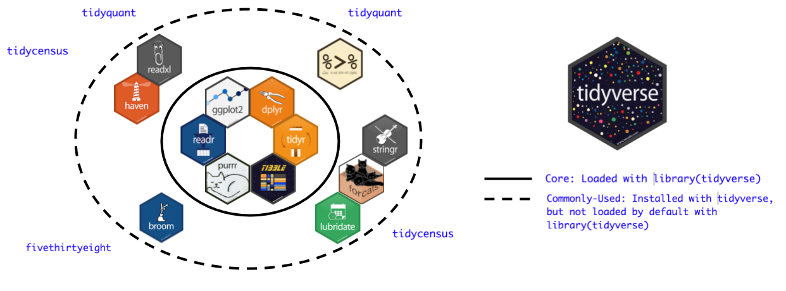

```{r setup, include=FALSE}
knitr::opts_chunk$set(echo = TRUE,
                      message = FALSE,
                      warning = FALSE,
                      out.width="100%")

if (!require(pacman)) install.packages("pacman")

p_load(drhur,
       here,
       rio,
       tidyverse)
```


## 知识点
- 研究问题：
   - 有几份涉及不同地区的调查数据，包括：非洲政治晴雨表调查数据、亚洲政治晴雨表调查数据、拉美政治晴雨表调查数据。  
   你想创造一个全球的政治晴雨表调查数据，应该怎么合并这些数据集呢？（提示：行合并）
   - 现在有两份数据：  
     数据1：中国各省份年度不平等认知的调查数据  
     数据2：各省年度省内收入差距数据     
     如果你想研究省内收入差距对居民不平等认知的影响，你应该如何合并这两份数据呢？（提示：索引合并，以省份与年度为索引）
   
- 单数据整理
    - 探索
    - 梳理
    - 筛选
    - 修改
- 跨数据整理
    - 直接合并
    - 索引合并

## 演示数据

{height=400}

我们从已故政治学教授Ronald Inglehart创立的[World Values Survey](https://www.worldvaluessurvey.org/wvs.jsp)第七波数据（WVS7）的一个样本进行演示。
这个样本是WVS7中2%的数据，包含24个变量。
具体变量信息可通过`?drhur::wvs7`查看。

## 数据探索

数据探索指对陌生数据的数据构成、结构、形式、内容的初步了解，是数据分析的第一步，也是关键一步。

### 概览原始数据

```{r glimpse, exercise = TRUE, exercise.eval = TRUE}
wvs7
```

- Tidy data（`tibble`）
    - 行：观测单元
    - 列：变量
    - 单元：数值

### 了解数据结构

- 观测量
- 变量名及数量
- 数据结构

```{r systemView, exercise = TRUE}
wvs7
```

```{r systemView-solution}
nrow(wvs7) # 获取数据的行数
ncol(wvs7) # 获取数据的列数
names(wvs7) # 获取变量名/列名
str(wvs7) # 获取变量名、变量名类型、行数、列数
```


### 变量提取

基于数据讨论变量特征，首先要了解如何表达数据和变量的从属关系。
包括R在内的OOP系统非常擅长多数据、多变量的协同使用和分析。
换言之，与一些常见数据分析软件不同，R可以同时加载和综合使用多个数据——只要将他们存入不同的对象即可。

OOP &rarr; 多数据分析 &rarr; 数据信息 + 变量信息

```{r variable, exercise = TRUE}
wvs7[, "country"]
```

```{r variable-solution}
wvs7$country
```

### 变量特征

变量信息提取与上一节中的向量信息提取完全一致。
我们也可以通过`table`命令获得变量分布，通过`summary`命令获得常见变量信息。
当然，R也支持获取年龄变量的总和、平均数、中位数、最小值、最大值、方差、IQR等，这些方法我们会在下一节仔细讨论。

```{r varCal, exercise = TRUE}
table(wvs7$age)
summary(wvs7$age)
```

对于非数值型变量，我们可以通过总结表的形式获取他们的信息

```{r varCat}
table(wvs7$female)
table(wvs7$marital)
```


对于基于factor的变量，我们还能提取他们的层级信息

```{r varLevel}
levels(wvs7$religious)
levels(wvs7$marital)
```

### 变量属性

变量可能由于其类不同而具有不同的特征，比如定类向量就没法求平均值，因此`mean`对于他们就是无意义的。
但所有变量都具有一些属性特征，比如变量的长度、类别、特征值等。
而对这些特征的提取命令也是共通的。

```{r varAttr}

```

```{r varAttr-solution}
length(wvs7$age) #求取年份的长度（此处为行数）
unique(wvs7$age)

summary(wvs7$age) #获取年份的上述所有信息
class(wvs7$age) #查看年份结构：vector、matrix、array、dataframe、list
typeof(wvs7$age) #查看年份元素类型
```

### 变量总览

```{r summary}
summary(wvs7$age)
summary(wvs7)
```


## 数据梳理

如果说数据探索是从数据中看变量，那么数据梳理就是以变量为索引来了解数据。
从实用角度出发，我们这里直接介绍如何使用`tidyverse`进行数据梳理。
但其实绝大部分数据梳理都是可以通过R的自带语句完成的。
我们也将自带语句对于同一任务的操作放置在“提示”单元中。

<!-- 睿哲，请使用R基础语句完成以下操作，放置在hint中。 -->


### 

首先介绍一下`tidyverse`

+ 是一个R包
+ 是一群[R包](https://www.tidyverse.org/packages/)！
+ 像漫威和DC漫画宇宙一样，所有`tidyverse`组成成员都在同一个数据结构内工作，可以相互对话，共同使用。

{height=300}


### 安装

```{r loadTidy, eval=FALSE}
install.packages("tidyverse")
library("tidyverse")
```


### `dplyr`包

`tidyverse`中专门负责数据清理的组件，贯彻一个函数做一件事的风格。


<!-- 睿哲，请在网上找到中文cheatsheet,截图替换，并标明出处 -->

### 通道

在逐一介绍`dplyr`的主要命令前，我们要先说明一下“通道”（pipe）。
通道在R中可以直接使用`|>`表示，在叫起`dplyr`后还可以使用功能更强的`%>%`。
我们后面的例子直接使用后者。
在R中，通道起到连接对于同一个对象的连续动作，相当于动作游戏中“搓”一个连续技。

{height=400}

###

另一方面，通道也能让每个命令排布更加明确、易读。
再举一个例子，如果我们用代码来模拟煮饺子的全过程，大体是这样：

```{r embeddedCode, eval=FALSE}
eat_dumpling <- 
eat(
  dip(
    cook(
      fill(
        mix(
          meat, 
          with = c(salt, soy_sauce, green_onion, ginger)
          ), 
        with = wrapper
        ), 
      in = boilled_water
      ), 
    in = vinegar)
  )
```

###

使用通道后，可以写成这样

```{r pipeCode, eval=FALSE}
eat_dumpling <- 
mix(meat, with = c(salt, soy_sauce, green_onion, ginger)) %>% 
  fill(with = wrapper) %>% 
  cook(in = boilled_water) %>% 
  dip(in = vinegar) %>% 
  eat
```


`%>%`的快捷键:

* Ctrl + Shift + M (Win)
* Cmd + Shift + M (Mac)


### 变量筛选

`select(<data>, <var1>, <var2>, ...)`

现在数据中有24个变量，有一些有意思的变量排在后面不方便看到，我们希望看到一个只有国家、年龄、教育水平和对政府信心的数据框：

```{r select, exercise=TRUE}
select(wvs7, country, age, education, confidence_gov)

# 如果我们想看到关于信心的所有变量，除了逐个列出来以外还能怎么做？
```

```{r select-solution}
select(wvs7, country, age, education, starts_with("confidence"))
```

和`starts_with`类似的还有`ends_with`和`matches`。

> 提示：注意第三人称变单数😝

### 

删除变量可以通过`-`实现：

```{r deselect}
select(wvs7, -(country:education))
```

###

一个`select`衍生体是`rename`，语法为`new.name = old.name`

```{r rename, exercise = TRUE}
rename(wvs7, nationality = country)
```


### 数据排序

`arrange(<data>,...)`

比如我们好奇最年轻的人群对国家机关的信心，并对应他们的教育水平、收入水平等信息。

```{r arrange, exercise = TRUE}
select(wvs7, age, confidence_gov, education, incomeLevel)
```

```{r arrange-solution}
select(wvs7, age, confidence_gov, education, incomeLevel) %>% 
  arrange(age)
```

那最年长的那群人呢？

```{r arrangeDesc, exercise = TRUE}
select(wvs7, age, confidence_gov, education, incomeLevel) %>% 
  arrange(desc(age))

## 如果我们想知道最年轻又教育最高的人呢？
```

```{r arrangeDesc-solution}
select(wvs7, age, confidence_gov, education, incomeLevel) %>% 
  arrange(age, desc(education))
```

### 变量值筛选

前面提到`select`是对数据库变量的筛选，`filter`则基于变量值的筛选。
延续上面的例子，如果我们好奇*美国*最年轻的一群人对国家机关的信心以及他们的教育水平和收入水平。

```{r filter, exercise=TRUE}
select(wvs7, age, confidence_gov, education, incomeLevel) %>% 
  arrange(age)
```


```{r filter-solution}
select(wvs7, age, confidence_gov, education, incomeLevel, country) %>% 
  filter(country == "United States") %>% 
  arrange(age)

select(wvs7, age, confidence_gov, education, incomeLevel, country) %>% 
  filter(country == "United States") %>% 
  filter(age == min(age, na.rm = TRUE))
```

### 数据修改

在数据分析中，我们常常要将数据进行调整和再加工，`mutate`可以帮你做到这一点。
英文中“mutate”表示“变异”，也就是说这个函数可以实现的并不是无中生有，而是改头换面。


###

如果我们关心教育水平对收入水平差异的影响，我们可以建立一个比例变量

```{r mutate, exercise = TRUE}
mutate(wvs7, ratio_incomeEdu = incomeLevel / (education + 1)) %>%
  select(country, incomeLevel, education, ratio_incomeEdu) %>%
  arrange(desc(ratio_incomeEdu))

# 如果要把`ratio_incomeEdu`变成一个百分数，怎么办？
```

```{r mutate-solution}
mutate(wvs7, 
       ratio_incomeEdu = incomeLevel / (education + 1),
       ratio_incomeEdu = as.numeric(ratio_incomeEdu) %>%
         scales::percent()) %>%
  select(country, ratio_incomeEdu)
```


### 数值统计

`count`用来基于数据计数。
比如，可以使用count来计算我们的数据中男性、女性各有多少人。^[这种列表在人口普查等统计数据中非常常见。]

```{r count, exercise = TRUE}
wvs7 %>%
  count(female)

# 如果想知道不同年龄段的男女数量怎么办呢？
```

```{r count-solution}
wvs7 %>%
  count(age, female)
```


### 

`summarise` 用来将个体数据转换成统计数据。
比如，我们想获得样本的年龄和教育水平平均数


```{r summarise, exercise = TRUE}
wvs7 %>%
  summarise(age = mean(age, na.rm = TRUE),
            edu = mean(education, na.rm = TRUE))
```

### 

`group_by`使分组操作成为可能：

```{r ex_summaryG, exercise = TRUE}
wvs7 %>%
  group_by(female) %>% 
  summarise(age = mean(age, na.rm = TRUE),
            edu = mean(education, na.rm = TRUE))
```

`group_by`实际是为现有数据建立群体索引，之后的所有操作都将在分组进行。
这一命令的逆操作是`ungroup`。


## Bonus

怎么样才能填补缺失的 `x`, 然后把 `y` 和 `z` 合并成一个变量呢?

```{r coalesce, exercise = TRUE}
df_toy <- data.frame(x = sample(c(1:2, NA, NA, NA)),
                     y = c(1, 2, NA, NA, 5),
                     z = c(NA, NA, 3, 4, 5))

df_toy
```


```{r coalesce-solution}
df_toy %>%
  mutate(x = coalesce(x, 0L),
         yz = coalesce(y, z)) # Ta-da~~~
```


## 数据整理原则

我们上面的一系列操作都有一个共同的特点，你发现了吗？

```{r rawData}
head(wvs7)
```

- <span style="color:red">不碰</span>原始数据
- 对象覆盖需谨慎

```{r overwrite, exercise}
wvs7 <- mutate(wvs7, female = as.numeric(female))
```


## 数据整合
### 直接合并

直接合并的前提基本和矩阵运算是基本一致的：只有前列数对得上后行才能进行。

- 行合并： 列数<span style="color:red">相等</span>(并不是~)
- 列合并： 行数<span style="color:red">相等</span>

分别举个例子：

```{r bindRow, exercise = TRUE}
wvs7_us <- filter(wvs7, country == "United States")
wvs7_russia <- filter(wvs7, country == "Russia")

# 创建一个美俄数据

bind_rows(wvs7_us, wvs7_russia)

# 不等列行合并会发生什么？
```

```{r bindRow-hint}
# Try this
bind_rows(tibble(x = 1:3), tibble(y = 1:4))
```

```{r bindCol, exercise = TRUE}
wvs7_conf <- select(wvs7, starts_with("confidence"))
wvs7_trust <- select(wvs7, starts_with("trust"))

# 创建一个信心-信任数据

bind_cols(wvs7_conf, wvs7_trust)
```


### 索引合并

索引合并指的是基于共享的索引序列（可以是任何变量）合并数据。

让我们先创建两个演示数据:

1. 个体层级平等认知数据；
1. 国家层级人口变量数据。

如果`wvs7_eq`是调查数据，`wvs7_country`是人口统计数据，我们的研究需要将这两组数据合并分析个体层级和国家层级变量间的关系。

```{r join, exercise = TRUE}
wvs7_eq <- select(wvs7, country, starts_with("equal")) %>% 
  filter(country %in% unique(country)[1:2])

wvs7_country <- group_by(wvs7, country) %>% 
  summarise(across(female:education, mean, na.rm = TRUE)) %>% 
  ungroup %>% 
  filter(country %in% unique(country)[2:3])
```

```{r join-solution}
inner_join(wvs7_eq, wvs7_country)
left_join(wvs7_eq, wvs7_country)
right_join(wvs7_eq, wvs7_country)
full_join(wvs7_eq, wvs7_country)
```


## 总结

1. 行动<span style="color:red">之前</span> 想清楚;
1. 巧妙且综合地使用 `dplyr` 函数;
    + 探索: `head`, `tail`
        - 结构：`nrow`, `ncol`, `names`, `str`
        - 特征：`table`, `levels`
        - 属性：`length`, `unique`, `summary`, `class`, `typeof`
    + 梳理: `dplyr`命令集
1. 数据整合原则：不碰原数据
1. 数据合并
    - 直接合并：`bind_*`
    - 索引合并：`*_join`

