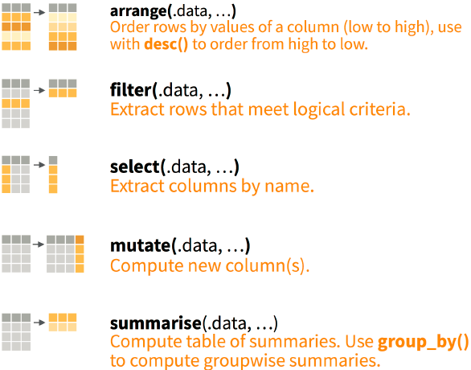

```{r setup, include=FALSE}
library(learnr)
library(drhur)
library(lubridate)
library(here)
library(rio)
library(tidyverse)
```


## 知识点

- 单数据整理
    - 探索
    - 梳理
    - 筛选
    - 修改
- 跨数据整理
    - 直接合并
    - 索引合并

## 演示数据

{height=400}

我们从已故政治学教授Ronald Inglehart创立的[World Values Survey](https://www.worldvaluessurvey.org/wvs.jsp)第七波数据（WVS7）的一个样本进行演示。
这个样本是WVS7中2%的数据，包含24个变量。
具体变量信息可通过`?drhur::wvs7`查看。

## 数据探索

数据探索指对陌生数据的数据构成、结构、形式、内容的初步了解，是数据分析的第一步，也是关键一步。

### 概览原始数据

```{r glimpse, exercise = TRUE, exercise.eval = TRUE}
wvs7
```

```{r glimpse-hint}
library(drhur)

glimpse(wvs7)
```

- Tidy data（`tibble`）
    - 行：观测单元
    - 列：变量
    - 单元：数值

### 有限数据呈现

对于复杂数据，我们或许不需要看到全貌

```{r headTail}
head(wvs7, n = 6)
tail(wvs7, n = 7)
```


### 了解数据结构

- 观测量
- 变量名及数量
- 数据结构

```{r systemView, exercise = TRUE}
wvs7
```

```{r systemView-solution}
nrow(wvs7) # 获取数据的行数
ncol(wvs7) # 获取数据的列数
names(wvs7) # 获取变量名/列名
str(wvs7) # 获取变量名、变量名类型、行数、列数
```


### 变量提取

基于数据讨论变量特征，首先要了解如何表达数据和变量的从属关系。
包括R在内的OOP系统非常擅长多数据、多变量的协同使用和分析。
换言之，与一些常见数据分析软件不同，R可以同时加载和综合使用多个数据——只要将他们存入不同的对象即可。

OOP &rarr; 多数据分析 &rarr; 数据信息 + 变量信息

```{r variable, exercise = TRUE}
wvs7[, "country"]
```

```{r variable-solution}
wvs7$country
```

### 变量特征

变量信息提取与上一节中的向量信息提取完全一致。
比如获取年龄变量的总和、平均数、中位数、最小值、最大值、方差、IQR

```{r varCal, exercise = TRUE}

```

```{r varCal-solution}
sum(wvs7$age)
mean(wvs7$age) #求取年份的平均值，na.rm = TRUE表示忽略NA
median(wvs7$age) #求取年份的中间值
min(wvs7$age) #求取年份的最小值
max(wvs7$age) #求取年份的最大值
var(wvs7$age, na.rm = TRUE)
quantile(wvs7$age, 3/4, na.rm = TRUE)
quantile(wvs7$age, 1/4, na.rm = TRUE)
IQR(wvs7$age, na.rm = TRUE) # quantile(x, 3/4) - quantile(x, 1/4)
```

> 提示：`na.rm` 是指如何对待缺失变量，通常是逻辑值，取`TRUE`表示命令运行前去除缺失变量。

对于非数值型变量，我们可以通过总结表的形式获取他们的信息

```{r varCat}
table(wvs7$female)
table(wvs7$marital)
```

对于基于factor的变量，我们还能提取他们的层级信息

```{r varLevel}
levels(wvs7$religious)
levels(wvs7$marital)
```

### 变量属性

变量可能由于其类不同而具有不同的特征，比如定类向量就没法求平均值，因此`mean`对于他们就是无意义的。
但所有变量都具有一些属性特征，比如变量的长度、类别、特征值等。
而对这些特征的提取命令也是共通的。

```{r varAttr}

```

```{r varAttr-solution}
length(wvs7$age) #求取年份的长度（此处为行数）
unique(wvs7$age)

summary(wvs7$age) #获取年份的上述所有信息
class(wvs7$age) #查看年份结构：vector、matrix、array、dataframe、list
typeof(wvs7$age) #查看年份元素类型
```

### 变量总览

```{r summary}
summary(wvs7$age)
summary(wvs7)
```


## 数据梳理

如果说数据探索是从数据中看变量，那么数据梳理就是以变量为索引来了解数据。
从实用角度出发，我们这里直接介绍如何使用`tidyverse`进行数据梳理。
但其实绝大部分数据梳理都是可以通过R的自带语句完成的。
我们也将自带语句对于同一任务的操作放置在“提示”单元中。

<!-- 睿哲，请使用R基础语句完成以下操作，放置在hint中。 -->


### 

首先介绍一下`tidyverse`

+ 是一个R包
+ 是一群[R包](https://www.tidyverse.org/packages/)！
+ 像漫威和DC漫画宇宙一样，所有`tidyverse`组成成员都在同一个数据结构内工作，可以相互对话，共同使用。

{height=300}


### 安装

```{r loadTidy, eval=FALSE}
install.packages("tidyverse")
library("tidyverse")
```


### `dplyr`包

`tidyverse`中专门负责数据清理的组件，贯彻一个函数做一件事的风格。


<!-- 睿哲，请在网上找到中文cheatsheet,截图替换，并标明出处 -->

### 通道

在逐一介绍`dplyr`的主要命令前，我们要先说明一下“通道”（pipe）。
通道在R中可以直接使用`|>`表示，在叫起`dplyr`后还可以使用功能更强的`%>%`。
我们后面的例子直接使用后者。
在R中，通道起到连接对于同一个对象的连续动作，相当于动作游戏中“搓”一个连续技。

{height=400}

###

另一方面，通道也能让每个命令排布更加明确、易读。
再举一个例子，如果我们用代码来模拟煮饺子的全过程，大体是这样：

```{r embeddedCode, eval=FALSE}
eat_dumpling <- 
eat(
  dip(
    cook(
      fill(
        mix(
          meat, 
          with = c(salt, soy_sauce, green_onion, ginger)
          ), 
        with = wrapper
        ), 
      in = boilled_water
      ), 
    in = vinegar)
  )
```

###

使用通道后，可以写成这样

```{r pipeCode, eval=FALSE}
eat_dumpling <- 
mix(meat, with = c(salt, soy_sauce, green_onion, ginger)) %>% 
  fill(with = wrapper) %>% 
  cook(in = boilled_water) %>% 
  dip(in = vinegar) %>% 
  eat
```


`%>%`的快捷键:

* Ctrl + Shift + M (Win)
* Cmd + Shift + M (Mac)


### 变量筛选

`select(<data>, <var1>, <var2>, ...)`

现在数据中有24个变量，有一些有意思的变量排在后面不方便看到，我们希望看到一个只有国家、年龄、教育水平和对政府信心的数据框：

```{r select, exercise=TRUE}
select(wvs7, country, age, education, confidence_gov)

# 如果我们想看到关于信心的所有变量，除了一个一个的列出来以外还能怎么做？
```

```{r select-solution}
select(wvs7, country, age, education, starts_with("confidence"))
```


### 数据排序

`arrange(<data>,...)`


比如我们好奇那些最年轻的人谁对国家机关特别没信心，然后了解一下他们来自的国家、年龄、教育水平等信息。

```{r arrange, exercise = TRUE}
arrange(wvs7, confidence_gov) 

arrange(wvs7, desc(confidence_gov)) 
```

### 数值筛选

### `count`

数据中对于每个国家各有多少个观测值？

```{r ex_count, exercise = TRUE}
wvs7 %>%
  count(country)

# wvs7 %>%
#   add_count(country) # adding the count number to the dataset.
```

### `summary`

```{r out.width = "95%", echo = FALSE}
knitr::include_graphics("images/summarise.png")
```

###

年龄和受教育年限的中位数分别是什么?

```{r ex_summary, exercise = TRUE}
wvs7 %>%
  summarise(mean_age = mean(age), median_edu = median(edu))
```

### `group_by`

```{r out.width = "95%", echo = FALSE}
knitr::include_graphics("images/group_by.png")
```

###

*每个国家的*年龄和受教育年限的中位数分别是多少？

```{r ex_summaryG, exercise = TRUE}
wvs7 %>%
  group_by(country) %>%
  summarise(mean_age = mean(age), median_edu = median(edu))
```

## 数据筛选

`dplyr`中也能帮助我们实现数据提取，主要通过`filter`和`select`实现。

### `filter`

```{r out.width = "95%", echo = FALSE}
knitr::include_graphics("images/filter.png")
```

###

如何知道*2018*年哪个国家的人口数量最多？

```{r ex_filter, exercise = TRUE, exercise.eval = FALSE}
wvs7 %>%
  arrange(desc(id))
```

```{r ex_filter-solution}
wvs7 %>%
  filter(year == 2007) %>% #filter函数筛选出年份为2007年
  arrange(desc(id)) #再根据采访id进行降序排列
```

### `select`

```{r out.width = "95%", echo = FALSE}
knitr::include_graphics("images/select.png")
```

1. 提取国家，年份和人口
2. 除了大洲的一切
3. 以"co"开头的变量

###

```{r ex_select, exercise = TRUE}
wvs7 %>%
  dplyr::select(country, year, pop) #选择国家、年份、人口规模
```

```{r ex_select-solution}
wvs7 %>%
  select(-country) #去掉国家

wvs7 %>%
  select(starts_with("co")) #匹配以“co”开头的名称
```


### 挑战时间？

想要从跨年数据中提取2018年的国家及其年龄和受教育程度，应该怎么做？


```{r out.width = "80%", echo = FALSE}

```

###

<!-- ```{r ex_combo-solution} -->
<!-- wvs7 %>% -->
<!--   filter(year == 2018) %>% -->
<!--   arrange(desc(age)) %>% -->
<!--   dplyr::select(country, age, edu) -->
<!-- ``` -->

## 数据修改

在数据分析中，我们常常要将数据进行调整和再加工，`mutate`可以帮你做到这一点。
英文中“mutate”表示“变异”，也就是说这个函数可以实现的并不是无中生有，而是改头换面。

### `mutate`

```{r out.width = "95%", echo = FALSE}
knitr::include_graphics("images/mutate.png")
```

###

知道了年龄和受教育程度，如何知道受教育水平/比例?

```{r ex_mutate, exercise = TRUE}
wvs7 %>%
  mutate(age_edu = edu/age) %>% #可根据已有变量添加新的变量，将新添加的列到已有列的末尾
    dplyr::select(country, age,edu)
```

### 条件性改变

如何对变量进行批量修改？`dplyr`和它的朋友`tidyselect`提供了`across`和`where`函数。
让我们看看如何通过这些函数实现将数据中所有的非整数变量都四舍五入取整？

```{r ex_batch, exercise = TRUE}
wvs7 %>%
  mutate(across(where(is.double), round, digits = 0))
```

### 根本原则

基于`tidyverse`的数据整理，有一个重要的核心前提：“不改变原始数据”——这也是所有数据分析者都应遵守的原则。
你会发现无论你使用以上命令对原数据做了什么, 你实际都<span style="color:red">没有</span>增加或改变`wvs7`的任何东西。

如果你想把变化保存下来, 你要把结果赋值给一个新的对象，而保持你原来数据的完整性。

```{r eval = FALSE}
wvs7New <- wvs7 %>% ...
```

## 数据整合
### 直接合并
### 索引合并
## 总结

1. 行动<span style="color:red">之前</span> 想清楚;
1. 巧妙且综合地使用 `dplyr` 函数;
    + 探索: `glimpse`
    + 归纳: `arrange`, `count`, `summarise`
    + 提取: `filter`, `select`
    + 调整: `mutate`
1. 条件性操作
    + `group_by`
    + `across` & `where`
    + `starts_with`, etc.

## Bonus

```{r df_coalesce, exercise = TRUE}
df_toy <- data.frame(x = sample(c(1:2, NA, NA, NA)),
                     y = c(1, 2, NA, NA, 5),
                     z = c(NA, NA, 3, 4, 5))

df_toy
```

###

怎么样才能填补缺失的 `x`, 然后把 `y` 和 `z` 合并成一个变量呢?

```{r coalesce, exercise = TRUE}
df_toy %>%
  mutate(x = coalesce(x, 0L),
         yz = coalesce(y, z))
```


### 感谢聆听，下次再见！

